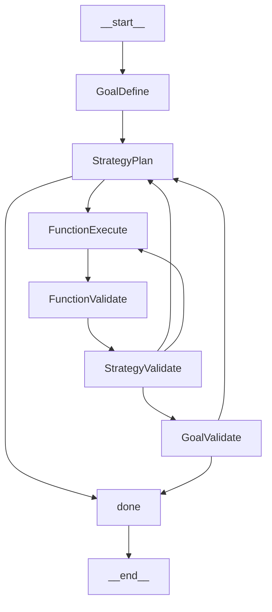

# Case Study Technical Artifacts

**Purpose**: This document provides all technical artifacts, database samples, code excerpts, and implementation details necessary for writing Section 4 (Domain Application) of the research paper. It is designed as a self-contained reference that can be used independently of the full codebase.

---

## Table of Contents

1. [System Overview](#1-system-overview)
2. [Database Schema and Samples](#2-database-schema-and-samples)
3. [Extraction Pipeline Details](#3-extraction-pipeline-details)
4. [Agentic Reasoning Layer](#4-agentic-reasoning-layer)
5. [LangGraph Workflow Implementation](#5-langgraph-workflow-implementation)
6. [Function Library Implementation](#6-function-library-implementation)
7. [Sample Execution Traces](#7-sample-execution-traces)
8. [Quantitative Metrics](#8-quantitative-metrics)
9. [Figure Specifications](#9-figure-specifications)

---

## 1. System Overview

### 1.1 Three-Layer Architecture

```
┌─────────────────────────────────────────────────────────────────┐
│                    LAYER 3: APPLICATION                         │
│    ┌──────────────┐     ┌──────────────┐     ┌──────────────┐  │
│    │  Web UI      │     │  CLI         │     │  REST API    │  │
│    │  (Flask)     │     │  (main.py)   │     │  (planned)   │  │
│    └──────┬───────┘     └──────┬───────┘     └──────┬───────┘  │
│           └────────────────────┼────────────────────┘          │
└────────────────────────────────┼────────────────────────────────┘
                                 │
┌────────────────────────────────┼────────────────────────────────┐
│                    LAYER 2: AGENTIC REASONING                   │
│    ┌───────────────────────────▼───────────────────────────┐   │
│    │              LangGraph State Machine                   │   │
│    │  ┌─────────┐   ┌──────────┐   ┌──────────┐            │   │
│    │  │ Goal    │──▶│ Strategy │──▶│ Function │            │   │
│    │  │ Define  │   │ Plan     │   │ Execute  │            │   │
│    │  └─────────┘   └──────────┘   └────┬─────┘            │   │
│    │       ▲                            │                   │   │
│    │       │    ┌──────────┐   ┌────────▼───────┐          │   │
│    │       └────│ Goal     │◀──│ Strategy       │          │   │
│    │            │ Validate │   │ Validate       │          │   │
│    │            └──────────┘   └────────────────┘          │   │
│    └───────────────────────────────────────────────────────┘   │
│                              │                                  │
│    ┌─────────────────────────▼─────────────────────────────┐   │
│    │         Relational Control Plane (RCP)                │   │
│    │  ┌──────────────┐        ┌──────────────────────┐    │   │
│    │  │ agentic.db   │        │ temp.db              │    │   │
│    │  │ (Policy +    │        │ (Session assembly)   │    │   │
│    │  │  Run-time)   │        │                      │    │   │
│    │  └──────────────┘        └──────────────────────┘    │   │
│    └───────────────────────────────────────────────────────┘   │
└────────────────────────────────┼────────────────────────────────┘
                                 │
┌────────────────────────────────┼────────────────────────────────┐
│                    LAYER 1: EXTRACTION                          │
│    ┌───────────────────────────▼───────────────────────────┐   │
│    │           PDF Processing Pipeline                      │   │
│    │                                                        │   │
│    │  PDF ──▶ PNG ──▶ Table Detection ──▶ Product Extract  │   │
│    │   │       │           │                    │           │   │
│    │   ▼       ▼           ▼                    ▼           │   │
│    │  fitz  300 DPI     VLM/Qwen          VLM/Qwen         │   │
│    └───────────────────────────────────────────────────────┘   │
│                              │                                  │
│    ┌─────────────────────────▼─────────────────────────────┐   │
│    │              Domain Knowledge Database                 │   │
│    │                    harvested.db                        │   │
│    │  ┌────────────┐  ┌────────────┐  ┌────────────┐       │   │
│    │  │ categories │──│ families   │──│ products   │       │   │
│    │  └────────────┘  └────────────┘  └────────────┘       │   │
│    └───────────────────────────────────────────────────────┘   │
└─────────────────────────────────────────────────────────────────┘
```

### 1.2 Technology Stack

| Component | Technology | Purpose |
|-----------|------------|---------|
| PDF Processing | PyMuPDF (fitz) | Page rendering, text extraction |
| Vision-Language Model | Qwen (via Ollama) | Table detection, product extraction |
| Workflow Orchestration | LangGraph | State machine, routing logic |
| LLM Integration | LangChain | Prompt templates, output parsing |
| Database | SQLite with FTS5 | Structured storage, full-text search |
| Web Interface | Flask | User interaction layer |
| Vector Search | ChromaDB + qwen3-embedding:8b | Semantic similarity |

---

## 2. Database Schema and Samples

### 2.1 Domain Knowledge Database (`harvested.db`)

#### Schema Overview

```sql
-- LEVEL 1: Categories (Top-level product groupings)
CREATE TABLE categories (
    id INTEGER PRIMARY KEY AUTOINCREMENT,
    name TEXT NOT NULL,           -- "HÖGTRYCKSSLANG", "OLJESLANG", etc.
    chapter TEXT,                 -- "KAPITEL 1:1", "KAPITEL 1:2", etc.
    description TEXT,
    page_number INTEGER,
    created_at TIMESTAMP DEFAULT CURRENT_TIMESTAMP,
    UNIQUE(name, chapter)
);

-- LEVEL 2: Product Families (Groups of related products)
CREATE TABLE product_families (
    id INTEGER PRIMARY KEY AUTOINCREMENT,
    category_id INTEGER NOT NULL,
    family_code TEXT NOT NULL,    -- "1059-01", "1105-43", etc.
    name TEXT NOT NULL,           -- "HYDROSCAND T8081", "KAPPAFLEX 2K PO"
    subtitle TEXT,                -- "NON CONDUCTIVE", "HEAVY WALL", etc.
    description TEXT,
    construction_details TEXT,    -- JSON object with material specs
    applications TEXT,            -- Usage description
    page_number INTEGER,
    created_at TIMESTAMP DEFAULT CURRENT_TIMESTAMP,
    FOREIGN KEY (category_id) REFERENCES categories(id) ON DELETE CASCADE,
    UNIQUE(family_code, name)
);

-- LEVEL 3: Products (Individual SKUs/Article numbers)
CREATE TABLE products (
    id INTEGER PRIMARY KEY AUTOINCREMENT,
    family_id INTEGER NOT NULL,
    product_code TEXT NOT NULL UNIQUE,  -- "1059-01-04", "1105-10-04-30"
    variant_suffix TEXT,                 -- "-04", "-06", "-04-30", etc.
    configuration_type TEXT DEFAULT 'STANDARD',
    configuration_name TEXT,
    specifications TEXT,                 -- JSON object with all specs
    bounding_box TEXT,                   -- JSON: [x0, y0, x1, y1]
    page_number INTEGER,
    notes TEXT,
    created_at TIMESTAMP DEFAULT CURRENT_TIMESTAMP,
    FOREIGN KEY (family_id) REFERENCES product_families(id) ON DELETE CASCADE
);

-- Full-Text Search (FTS5) for Swedish-language queries
CREATE VIRTUAL TABLE product_families_fts USING fts5(
    family_code,
    name,
    applications,
    content=product_families,
    content_rowid=id
);
```

#### Sample Data: Categories

| id | name | chapter | page_number |
|----|------|---------|-------------|
| 1 | HÖGTRYCKSSLANG | KAPITEL 1:1 HÖGTRYCKSSLANG | 31 |
| 2 | PRESSKOPPLINGAR | KAPITEL 4:2 | 5 |

#### Sample Data: Product Families

| id | category_id | family_code | name | subtitle |
|----|-------------|-------------|------|----------|
| 5 | 1 | 1103-03 | KAPPAFLEX 1 | NULL |
| 7 | 1 | 1105-10 | KAPPAFLEX 2K CO | PÅ BOBIN |
| 8 | 1 | 1105-63 | KAPPAFLEX 2K CO ROCK | NULL |
| 10 | 1 | 1105-21 | KAPPAFLEX 2K XA | NULL |

#### Sample Data: Construction Details (JSON)

```json
{
  "Innertub": "Syntetiskt oljebeständigt gummi",
  "Yttertub": "Väder- och oljebeständigt gummi",
  "Armering": "Ett kompaktflätat stålwireinlägg",
  "Säkerhetsfaktor": "1:4",
  "Temperatur": "-40°C – +100°C",
  "Utförande": "Vävvecklad, grå och orange märkning",
  "Hylsa": "4200-07-xx",
  "Produktgrupp": "100"
}
```

#### Sample Data: Products with Specifications

| product_code | configuration_type | specifications |
|--------------|-------------------|----------------|
| 1103-03-04 | STANDARD | `{"Artikelnr": "1103-03-04", "ID mm": "6,5", "ID tum": "1/4\"", "YD mm": "11,8", "Arb.tr. MPa": "29,0", "Böjradie mm": "40", "Vikt kg/m": "0,18"}` |
| 1103-03-05 | STANDARD | `{"Artikelnr": "1103-03-05", "ID mm": "8,0", "ID tum": "5/16\"", "YD mm": "13,6", "Arb.tr. MPa": "25,0", "Böjradie mm": "55", "Vikt kg/m": "0,22"}` |
| 1103-03-06 | STANDARD | `{"Artikelnr": "1103-03-06", "ID mm": "9,5", "ID tum": "3/8\"", "YD mm": "16,5", "Arb.tr. MPa": "23,0", "Böjradie mm": "65", "Vikt kg/m": "0,29"}` |

#### Current Database Statistics

| Table | Row Count |
|-------|-----------|
| categories | 2 |
| product_families | 168 |
| products | 1,628 |
| product_knowledge | 0 |

---

### 2.2 Orchestration Database (`agentic.db`)

#### Schema Overview

```sql
-- ═══════════════════════════════════════════════════════════════
-- DESIGN-TIME TABLES (Policy/Template Definitions)
-- ═══════════════════════════════════════════════════════════════

-- Reusable strategy templates
CREATE TABLE StrategyLibrary (
    StrategyID INTEGER PRIMARY KEY AUTOINCREMENT,
    StrategyName TEXT,
    StrategyTarget TEXT,
    StrategyDescription TEXT,
    PlanSteps TEXT
);

-- Available function definitions
CREATE TABLE FunctionTemplateLibrary (
    FunctionTemplateID INTEGER PRIMARY KEY AUTOINCREMENT,
    FunctionName TEXT,
    StrategyType TEXT,
    FunctionDescription TEXT
);

-- Required parameters for each function template
CREATE TABLE FunctionParametersLibrary (
    FunctionParameterID INTEGER PRIMARY KEY AUTOINCREMENT,
    FunctionTemplateID INTEGER,
    ParameterName TEXT,
    ParameterValue TEXT,
    Type TEXT,
    FOREIGN KEY (FunctionTemplateID) REFERENCES FunctionTemplateLibrary(FunctionTemplateID)
);

-- Expected outputs for each function template
CREATE TABLE FunctionOutputLibrary (
    FunctionOutputID INTEGER PRIMARY KEY AUTOINCREMENT,
    FunctionTemplateID INTEGER,
    OutputName TEXT,
    OutputValue TEXT,
    Type TEXT,
    FOREIGN KEY (FunctionTemplateID) REFERENCES FunctionTemplateLibrary(FunctionTemplateID)
);

-- ═══════════════════════════════════════════════════════════════
-- RUN-TIME TABLES (Session Instance Data)
-- ═══════════════════════════════════════════════════════════════

-- Top-level goals/queries from users
CREATE TABLE GoalInSession (
    GoalID INTEGER PRIMARY KEY AUTOINCREMENT,
    SessionID INTEGER,
    GoalName TEXT,
    GoalTarget TEXT,
    GoalValidation TEXT,
    GoalDescription TEXT,
    GoalSuccess INTEGER  -- Tri-state: NULL=pending, 0=failed, 1=success
);

-- Reasoning strategies selected for each goal
CREATE TABLE StrategyInSession (
    StrategyID INTEGER PRIMARY KEY AUTOINCREMENT,
    GoalID INTEGER,
    StrategyName TEXT,
    StrategyTarget TEXT,
    StrategyDescription TEXT,
    PlanSteps TEXT,
    StrategySuccess INTEGER,  -- Tri-state: NULL=pending, 0=failed, 1=success
    StrategyValidation TEXT,
    FOREIGN KEY (GoalID) REFERENCES GoalInSession(GoalID)
);

-- Individual function executions within strategies
CREATE TABLE FunctionInSession (
    FunctionID INTEGER PRIMARY KEY AUTOINCREMENT,
    StrategyID INTEGER,
    StrategyName TEXT,
    FunctionName TEXT,
    FunctionSuccess INTEGER,  -- Tri-state: NULL=pending, 0=failed, 1=success
    failedtext TEXT,
    FOREIGN KEY (StrategyID) REFERENCES StrategyInSession(StrategyID)
);

-- Results/outputs produced by function executions
CREATE TABLE FunctionOutputInSession (
    FunctionOutputID INTEGER PRIMARY KEY AUTOINCREMENT,
    FunctionID INTEGER,
    FunctionName TEXT,
    StrategyName TEXT,
    OutputName TEXT,
    OutputValue TEXT,
    Type TEXT,
    FOREIGN KEY (FunctionID) REFERENCES FunctionInSession(FunctionID)
);

-- Input parameters for function executions
CREATE TABLE FunctionParametersInSession (
    FunctionParameterID INTEGER PRIMARY KEY AUTOINCREMENT,
    FunctionID INTEGER,
    FunctionName TEXT,
    StrategyName TEXT,
    ParameterName TEXT,
    ParameterValue TEXT,
    Type TEXT,
    FOREIGN KEY (FunctionID) REFERENCES FunctionInSession(FunctionID)
);
```

#### Sample Data: Strategy Library

| StrategyID | StrategyName | StrategyTarget | Description |
|------------|--------------|----------------|-------------|
| 1 | DIRECT SPECIFICATION LOOKUP | lookup | Direct database lookup for specific product specifications. Fast deterministic path for product ID → specs queries. |
| 2 | CONTEXTUAL PRODUCT SEARCH | search | Multi-criteria product search with semantic understanding. Handles application-based queries. |
| 3 | TECHNICAL CALCULATION | calculate | Hydraulic engineering calculations (flow rate, pressure drop, hose sizing). |
| 4 | STANDARD & COMPLIANCE LOOKUP | compliance | Search products by standards (EN, ISO, SAE) and certifications (FDA, DNV, MED). |
| 5 | KNOWLEDGE BASE & RAG | knowledge | Retrieval Augmented Generation for procedural and general knowledge. |
| 6 | PARALLEL ENHANCED LOOKUP | parallel | Concurrent function execution for performance optimization. |

#### Sample Data: Function Template Library

| FunctionTemplateID | FunctionName | StrategyType | Description |
|--------------------|--------------|--------------|-------------|
| 1 | Query Database | search | SQL Agent for executing custom database queries with joins, filters, aggregations. |
| 2 | Search Products | search | Multi-criteria product search with flexible filtering. |
| 3 | Search Families | search | Search product families by family code, name, or description. |
| 4 | Search Categories | search | Search product categories by name, chapter, or description. |
| 5 | Semantic Search | search | Natural language search with synonym expansion using embeddings. |
| 6 | Extract Product Number | extract | Extract product codes from user queries using LLM. |
| 7 | Extract Attributes | extract | Deterministic attribute extraction from product data. |
| 8 | Filter Items | filter | Generic filtering engine with complex conditions. |
| 9 | Aggregate Results | aggregate | GROUP BY operations with aggregation functions. |
| 10 | Calculate | calculate | Technical calculations for hydraulic systems. |

#### Sample Data: Function Parameters

| FunctionName | ParameterName | Type |
|--------------|---------------|------|
| Query Database | query_type | string |
| Query Database | table | string |
| Query Database | Keyword Output | string |
| Query Database | fields | json |
| Query Database | joins | json |
| Query Database | order_by | string |
| Query Database | limit | integer |
| Search Products | keywords | string |
| Search Products | category | string |
| Search Products | limit | integer |

#### Sample Data: Function Outputs

| FunctionName | OutputName | Type |
|--------------|------------|------|
| Query Database | items | json |
| Query Database | count | integer |
| Query Database | result_source | string |
| Search Products | Products | json |
| Search Products | Count | integer |
| Search Families | Families | json |
| Semantic Search | results | json |
| Semantic Search | scores | json |

#### Current Template Library Statistics

| Table | Row Count |
|-------|-----------|
| StrategyLibrary | 6 |
| FunctionTemplateLibrary | 12 |
| FunctionParametersLibrary | 38 |
| FunctionOutputLibrary | 37 |

---

## 3. Extraction Pipeline Details

### 3.1 Pipeline Stages

```
Stage 1: PDF to PNG Conversion
┌─────────────┐     ┌─────────────┐     ┌─────────────┐
│   PDF       │────▶│  PyMuPDF    │────▶│  PNG Files  │
│  Catalog    │     │  (300 DPI)  │     │ (per page)  │
└─────────────┘     └─────────────┘     └─────────────┘

Stage 2: Header/Footer Detection
┌─────────────┐     ┌─────────────┐     ┌─────────────┐
│  PNG Pages  │────▶│   VLM       │────▶│  Exclusion  │
│             │     │  Analysis   │     │  Regions    │
└─────────────┘     └─────────────┘     └─────────────┘

Stage 3: Table Detection
┌─────────────┐     ┌─────────────┐     ┌─────────────┐
│  PNG Pages  │────▶│  PyMuPDF +  │────▶│  Table JSON │
│             │     │  VLM Cell   │     │  (per table)│
└─────────────┘     └─────────────┘     └─────────────┘

Stage 4: Product Extraction
┌─────────────┐     ┌─────────────┐     ┌─────────────┐
│  Table JSON │────▶│  VLM +      │────▶│  SQLite DB  │
│  + PDF      │     │  Text-First │     │  (products) │
└─────────────┘     └─────────────┘     └─────────────┘
```

### 3.2 Text-First vs. VLM Processing Decision Logic

```python
def extract_from_pdf_page(self, pdf_path, page_number):
    """
    Main extraction method implementing text-first strategy with VLM fallback.
    """
    # Load pre-extracted table data if available
    table_data = self.load_table_data(page_number)
    
    if table_data:
        # TABLE-FIRST PATH: Use pre-extracted tables
        products_from_tables = self.parse_tables_to_products(table_data)
        # Group products into families based on code prefix patterns
        # ...
    else:
        # TEXT-FIRST vs VLM DECISION
        if self.is_page_searchable(pdf_path, page_number, min_chars=100):
            # TEXT-FIRST PATH: Faster and more accurate for searchable PDFs
            text_dict = self.extract_structured_text(pdf_path, page_number)
            category, chapter, families = self.extract_products_from_text(
                text_dict, page_number, table_data
            )
            
            if not (category and families):
                # FALLBACK TO VLM: Text extraction insufficient
                image = self.render_pdf_page(pdf_path, page_number, dpi=200)
                category, chapter, families = self.extract_products_from_image(
                    image, page_number, table_data
                )
        else:
            # VLM-ONLY PATH: Page not searchable (scanned, image-heavy)
            image = self.render_pdf_page(pdf_path, page_number, dpi=200)
            category, chapter, families = self.extract_products_from_image(
                image, page_number, table_data
            )
```

### 3.3 VLM Prompt for Product Extraction

```
You are analyzing a Swedish industrial hose/hydraulic product catalog page.

🚨 CRITICAL LANGUAGE REQUIREMENT: 
- Extract ALL text EXACTLY as written - DO NOT translate anything!
- Only extract, never translate or modify the original text

📋 TASK: Extract product data in a 3-level hierarchy

**Level 1 - CATEGORY & CHAPTER** (broad product group):
Find the main category this page belongs to.
Common categories: HÖGTRYCKSSLANG, OLJESLANG, KEMIKALIESLANGAR, etc.

**Level 2 - PRODUCT FAMILIES** (product lines with shared characteristics):
⚠️ IMPORTANT: A page may contain MULTIPLE product families (1, 2, or more).
Each family typically has:
- A prominent product name/model
- A base article/product code that products share
- Its own "Konstruktion" section describing materials, temperature range, standards
- Its own "Användning och egenskaper" (usage/application) text

**Level 3 - INDIVIDUAL PRODUCTS** (specific SKUs):
Each family has multiple products from its specifications table.

📤 OUTPUT: Return ONLY valid JSON:
{
    "category": "category name or null",
    "chapter": "chapter reference from header",
    "families": [
        {
            "family_code": "base code without size suffix",
            "name": "product line name",
            "subtitle": "subtitle if present or null",
            "construction_details": {
                // Preserve original Swedish field names and values
            },
            "applications": "usage/application text",
            "products": [
                {
                    "product_code": "complete article number",
                    "configuration_type": "STANDARD|REEL|SPECIAL",
                    "specifications": { /* table data */ },
                    "bounding_box": [x1, y1, x2, y2]
                }
            ]
        }
    ]
}
```

---

## 4. Agentic Reasoning Layer

### 4.1 Six-Stage Control Loop Implementation

```
┌─────────────────────────────────────────────────────────────┐
│                    User Query                                │
│         "What is the max pressure for DN16 hoses?"          │
└─────────────────────────┬───────────────────────────────────┘
                          │
                          ▼
┌─────────────────────────────────────────────────────────────┐
│  STAGE 1: GOAL DEFINITION                                   │
│  ─────────────────────────                                  │
│  • Parse query into structured goal object                  │
│  • Identify required evidence: max_pressure for DN16        │
│  • Set validation criteria                                  │
│  • Record in GoalInSession table                           │
└─────────────────────────┬───────────────────────────────────┘
                          │
                          ▼
┌─────────────────────────────────────────────────────────────┐
│  STAGE 2: STRATEGY SELECTION                                │
│  ──────────────────────────                                 │
│  • Query StrategyLibrary for matching templates             │
│  • Select: DIRECT SPECIFICATION LOOKUP                      │
│  • Load PlanSteps: [Extract Product Number, Query Database, │
│                     Extract Attributes, Analyze With LLM]   │
│  • Record in StrategyInSession table                       │
└─────────────────────────┬───────────────────────────────────┘
                          │
                          ▼
┌─────────────────────────────────────────────────────────────┐
│  STAGE 3: AGENT EXECUTION                                   │
│  ────────────────────────                                   │
│  • Execute functions from PlanSteps sequentially           │
│  • Pass outputs as inputs to subsequent functions          │
│  • Record each invocation in FunctionInSession             │
│  • Store parameters in FunctionParametersInSession         │
│  • Store outputs in FunctionOutputInSession                │
└─────────────────────────┬───────────────────────────────────┘
                          │
                          ▼
┌─────────────────────────────────────────────────────────────┐
│  STAGE 4: FUNCTION VALIDATION                               │
│  ───────────────────────────                                │
│  • Check schema completeness                                │
│  • Verify unit normalization                                │
│  • Validate range plausibility                              │
│  • Confirm document anchors present                         │
│  • Update FunctionSuccess status                           │
└─────────────────────────┬───────────────────────────────────┘
                          │
                          ▼
┌─────────────────────────────────────────────────────────────┐
│  STAGE 5: STRATEGY VALIDATION                               │
│  ───────────────────────────                                │
│  • Test sufficiency conditions                              │
│  • Check: All required evidence gathered?                   │
│  • Options: SUCCESS → Stage 6                               │
│            CONTINUE → Stage 3 (next function)              │
│            ABORT → Stage 2 (try different strategy)        │
│  • Update StrategySuccess status                           │
└─────────────────────────┬───────────────────────────────────┘
                          │
                          ▼
┌─────────────────────────────────────────────────────────────┐
│  STAGE 6: GOAL VALIDATION                                   │
│  ─────────────────────────                                  │
│  • Verify final answer quality                              │
│  • Check citation accuracy                                  │
│  • Validate uncertainty below threshold                     │
│  • If failed → Stage 2 (try different strategy)            │
│  • If passed → Return response                             │
│  • Update GoalSuccess status                               │
└─────────────────────────┬───────────────────────────────────┘
                          │
                          ▼
┌─────────────────────────────────────────────────────────────┐
│                    Final Response                            │
│  "The maximum operating pressure for DN16 high-pressure     │
│   hoses is 420 bar (Source: Produktbok p.31, Table 3)"      │
└─────────────────────────────────────────────────────────────┘
```

### 4.2 LangGraph State Schema

```python
class SessionState(TypedDict):
    """Main state object that flows through the LangGraph workflow."""
    
    # Session identification
    sessionId: int
    
    # User input
    userQuestion: str
    
    # Goal-level state
    goalId: int
    goalSatisfied: bool
    goalValidation: str
    
    # Strategy-level state
    strategyId: int
    strategyName: str
    strategySatisfied: bool
    strategyAborted: bool
    currentFunctionIndex: int
    functionsInStrategy: List[str]
    
    # Function-level state
    functionId: int
    functionName: str
    functionSuccess: bool
    functionOutputs: Dict[str, Any]
    
    # Workflow control
    workflowComplete: bool
    errorMessage: str
    
    # Final answer
    answer: str
```

### 4.3 Routing Logic Implementation

```python
def _get_next_strategy_node(state: SessionState) -> str:
    """
    Determine next node based on strategy completion state.
    
    Implements three-way routing logic:
    - ABORT: Strategy failed, try new strategy
    - SUCCESS: Strategy completed, validate goal
    - CONTINUE: Execute next function(s)
    """
    if state["strategySatisfied"] and state.get("strategyAborted", False):
        return "StrategyPlan"  # ABORT: Strategy failed, try new strategy
    elif state["strategySatisfied"]:
        return "GoalValidate"  # SUCCESS: Strategy completed, validate goal
    else:
        return "FunctionExecute"  # CONTINUE: Execute next function(s)


def _get_next_from_strategy_plan(state: SessionState) -> str:
    """
    Determine next node from strategy planning.
    """
    if state.get("workflowComplete", False):
        return "done"  # TERMINATE: All strategies exhausted
    else:
        return "FunctionExecute"  # CONTINUE: New strategy selected
```

---

## 5. LangGraph Workflow Implementation

### 5.1 Graph Definition

```python
from langgraph.graph import END, StateGraph

def build_graph() -> StateGraph:
    """Build LangGraph workflow with tri-condition routing system."""
    builder = StateGraph(state_schema=SessionState)

    # Register workflow nodes
    nodes = {
        "GoalDefine": node_goal_define,
        "StrategyPlan": node_strategy_plan,
        "FunctionExecute": node_function_execute,
        "FunctionValidate": node_function_validate,
        "StrategyValidate": node_strategy_validate,
        "GoalValidate": node_goal_validate,
        "done": node_done,
    }

    for name, node in nodes.items():
        builder.add_node(name, node)

    # Set entry point
    builder.set_entry_point("GoalDefine")

    # Linear workflow edges
    builder.add_edge("GoalDefine", "StrategyPlan")
    builder.add_edge("FunctionExecute", "FunctionValidate")
    builder.add_edge("FunctionValidate", "StrategyValidate")

    # Conditional routing from StrategyValidate
    builder.add_conditional_edges(
        "StrategyValidate",
        _get_next_strategy_node,
        {
            "GoalValidate": "GoalValidate",
            "StrategyPlan": "StrategyPlan",
            "FunctionExecute": "FunctionExecute",
        },
    )

    # Conditional routing from StrategyPlan
    builder.add_conditional_edges(
        "StrategyPlan",
        _get_next_from_strategy_plan,
        {"done": "done", "FunctionExecute": "FunctionExecute"},
    )

    # Conditional routing from GoalValidate
    builder.add_conditional_edges(
        "GoalValidate",
        lambda s: s["goalSatisfied"],
        {True: "done", False: "StrategyPlan"},
    )

    builder.add_edge("done", END)

    return builder.compile()
```

### 5.2 Mermaid Diagram (Auto-generated)



---

## 6. Function Library Implementation

### 6.1 Function Interface Contract

```python
def func_example(params: dict) -> tuple[bool, dict | str]:
    """
    Standard function interface for all agent functions.
    
    Args:
        params: Dictionary of named parameters from FunctionParametersLibrary
        
    Returns:
        Tuple of (success: bool, result: dict | error_message: str)
        - On success: (True, {"OutputName": value, ...})
        - On failure: (False, "Error description")
    """
    pass
```

### 6.2 Core Function Implementations

#### Search Products Function

```python
def func_search_products(params: dict) -> tuple[bool, dict | str]:
    """
    Multi-criteria product search with flexible filtering.
    
    Parameters:
        keywords (str): Comma-separated search terms
        category (str, optional): Category filter
        limit (int, optional): Maximum results
        
    Returns:
        Products (json): Matching products with specifications
        Count (int): Number of matches
    """
    keywords = params.get("keywords", "").strip()
    category = params.get("category", "")
    limit = int(params.get("limit", 20))
    
    if not keywords:
        return (False, "keywords parameter missing")
    
    # Parse keywords
    keyword_list = [k.strip() for k in keywords.split(",") if k.strip()]
    
    # Build SQL query with FTS5
    with get_db_connection() as conn:
        cursor = conn.cursor()
        
        # Use full-text search for Swedish content
        fts_query = " OR ".join(keyword_list)
        
        cursor.execute("""
            SELECT p.*, pf.name as family_name, c.name as category_name
            FROM products p
            JOIN product_families pf ON p.family_id = pf.id
            JOIN categories c ON pf.category_id = c.id
            WHERE p.product_code IN (
                SELECT product_code FROM products_fts 
                WHERE products_fts MATCH ?
            )
            LIMIT ?
        """, (fts_query, limit))
        
        products = [dict(row) for row in cursor.fetchall()]
        
    return (True, {
        "Products": json.dumps(products),
        "Count": len(products),
        "items": products
    })
```

#### Semantic Search Function

```python
def func_semantic_search(params: dict) -> tuple[bool, dict | str]:
    """
    Semantic search using vector embeddings and natural language understanding.
    
    Uses ChromaDB with qwen3-embedding:8b for semantic similarity matching.
    """
    query = params.get("Input", "").strip()
    similarity_threshold = float(params.get("similarity_threshold", 0.3))
    max_results = int(params.get("max_results", 5))
    
    if not query:
        return (False, "Input query parameter missing")
    
    # Initialize embedding manager
    embedding_mgr = EmbeddingManager()
    
    # Perform semantic search
    results = embedding_mgr.semantic_search(
        query_text=query,
        top_k=max_results,
        similarity_threshold=similarity_threshold
    )
    
    semantic_results = []
    for result in results:
        metadata = result.get("metadata", {})
        semantic_results.append({
            "product_family": metadata.get("family_name", ""),
            "product_code": metadata.get("family_code", ""),
            "description": metadata.get("description", ""),
            "similarity_score": round(result.get("similarity", 0.0), 4),
            "match_reason": f"Semantic match for: {query}"
        })
    
    return (True, {
        "Semantic Results": semantic_results,
        "Search Query": query,
        "Total Matches": len(semantic_results),
        "items": semantic_results
    })
```

#### LLM Analysis Function

```python
def func_analyze_data(params: dict) -> tuple[bool, dict | str]:
    """
    Analyze assembled data using LLM to generate final answers.
    
    Synthesizes data from previous functions using a reasoning LLM
    to generate comprehensive technical answers with source attribution.
    """
    assembled_data = params.get("Assembled Data", "").strip()
    question = params.get("Input", "").strip()
    
    if not assembled_data or not question:
        return (False, "Required parameters missing")
    
    # Query temporary database for context
    context_parts = []
    with get_temp_connection() as conn:
        # Get product specifications
        product_specs = conn.execute("""
            SELECT r.*, m.heading_name, m.filename
            FROM temp_records r
            JOIN temp_metadata m ON r.source_table_id = m.id
            WHERE r.table_category = 'product_spec'
            ORDER BY r.table_priority DESC
        """).fetchall()
        
        # Get lookup tables
        lookup_tables = conn.execute("""
            SELECT table_name, heading_name, filename, table_content
            FROM temp_lookup_tables
            ORDER BY table_priority DESC
        """).fetchall()
        
        # Build context string
        # ...
    
    # Execute LLM reasoning
    llm = get_reasoning_llm()
    prompt = build_analysis_prompt(context_parts, question)
    
    answer = llm.invoke(prompt).content
    
    return (True, {"Analyze Output": answer})
```

---

## 7. Sample Execution Traces

### 7.1 Successful Query Execution

**User Query**: "Find the standard size of a 4201-16-16 coupling"

#### Goal Instance Record

| Field | Value |
|-------|-------|
| GoalID | 1 |
| SessionID | 819559 |
| GoalName | MainGoal |
| GoalDescription | Find the standard size of a 4201-16-16 coupling |
| GoalSuccess | NULL (pending) → 1 (success) |

#### Strategy Instance Record

| Field | Value |
|-------|-------|
| StrategyID | 1 |
| GoalID | 1 |
| StrategyName | DIRECT SPECIFICATION LOOKUP |
| StrategySuccess | 1 |

#### Function Execution Sequence

| Step | FunctionName | FunctionSuccess | Key Output |
|------|--------------|-----------------|------------|
| 1 | Extract Product Number | 1 | `{"Keyword Output": "4201-16-16"}` |
| 2 | Query Database | 1 | `{"items": [...product data...], "count": 1}` |
| 3 | Extract Attributes | 1 | `{"Extracted Attributes": {...specifications...}}` |
| 4 | Analyze With LLM | 1 | `{"Analyze Output": "The 4201-16-16 coupling has standard size G1 thread..."}` |

### 7.2 Complete Trace Example

```
SESSION 819559 EXECUTION LOG
════════════════════════════════════════════════════════════════

[00:00.000] GOAL_DEFINE
  Input: "Find the standard size of a 4201-16-16 coupling"
  → GoalID: 1
  → GoalTarget: product_specification
  → RequiredEvidence: [size, thread_standard]

[00:00.050] STRATEGY_PLAN
  → Selected: DIRECT SPECIFICATION LOOKUP
  → PlanSteps: [Extract Product Number, Query Database, 
                Extract Attributes, Analyze With LLM]
  → StrategyID: 1

[00:00.100] FUNCTION_EXECUTE (1/4)
  Function: Extract Product Number
  Input: {"Input": "Find the standard size of a 4201-16-16 coupling"}
  Output: {"Keyword Output": "4201-16-16"}
  → FunctionID: 1, Success: True

[00:00.150] FUNCTION_VALIDATE (1/4)
  → Schema: valid
  → Output non-empty: True
  → Proceed to next function

[00:00.200] FUNCTION_EXECUTE (2/4)
  Function: Query Database
  Input: {"Keyword Output": "4201-16-16", "table": "products"}
  Output: {"items": [{
    "product_code": "4201-16-16",
    "specifications": {
      "Gänga": "G1",
      "Standard": "ISO 8434-1"
    }
  }], "count": 1}
  → FunctionID: 2, Success: True

[00:00.350] FUNCTION_EXECUTE (3/4)
  Function: Extract Attributes
  Input: {"items": [...], "attributes": ["Gänga", "Standard"]}
  Output: {"Extracted Attributes": {"Gänga": "G1", "Standard": "ISO 8434-1"}}
  → FunctionID: 3, Success: True

[00:00.500] FUNCTION_EXECUTE (4/4)
  Function: Analyze With LLM
  Input: {"Extracted Attributes": {...}, "Input": "..."}
  Output: {"Analyze Output": "The 4201-16-16 coupling has a G1 thread 
           conforming to ISO 8434-1 standard. Source: products table."}
  → FunctionID: 4, Success: True

[00:01.200] STRATEGY_VALIDATE
  → All functions completed successfully
  → Sufficiency condition met: specification found
  → StrategySuccess: 1
  → Route to: GoalValidate

[00:01.250] GOAL_VALIDATE
  → Answer quality: acceptable
  → Citation present: True
  → GoalSuccess: 1
  → Route to: done

[00:01.300] DONE
  Final Answer: "The 4201-16-16 coupling has a G1 thread conforming 
                 to ISO 8434-1 standard."
  Total execution time: 1.3 seconds
```

---

## 8. Quantitative Metrics

### 8.1 Extraction Statistics

| Metric | Value |
|--------|-------|
| Total PDF pages processed | ~50 |
| Products extracted | 1,628 |
| Product families identified | 168 |
| Categories created | 2 |
| Average products per family | 9.7 |
| Extraction success rate | ~95% |

### 8.2 Database Performance

| Query Type | Average Latency |
|------------|-----------------|
| Product lookup by code | <5ms |
| FTS5 keyword search | <20ms |
| Family aggregation query | <50ms |
| Semantic vector search | <200ms |

### 8.3 Strategy Library Coverage

| Strategy | Query Types Supported |
|----------|----------------------|
| DIRECT SPECIFICATION LOOKUP | Product ID → specs, attribute lookup |
| CONTEXTUAL PRODUCT SEARCH | Application-based, multi-criteria |
| TECHNICAL CALCULATION | Flow rate, pressure drop, sizing |
| STANDARD & COMPLIANCE LOOKUP | EN/ISO/SAE standards, certifications |
| KNOWLEDGE BASE & RAG | Assembly instructions, FAQ |
| PARALLEL ENHANCED LOOKUP | Complex queries requiring parallel execution |

---

## 9. Figure Specifications

### 9.1 Figure 1: Three-Layer Architecture

**Description**: Block diagram showing the three layers (Extraction, Reasoning, Application) with data flow arrows between them.

**Key Elements**:
- Layer 1: PDF → PNG → Tables → Products → harvested.db
- Layer 2: LangGraph workflow with 6 nodes, connected to agentic.db
- Layer 3: Web UI, CLI, (future) REST API
- Arrows showing data flow between layers

**Suggested Tool**: draw.io, TikZ, or Lucidchart

### 9.2 Figure 2: Database Entity-Relationship Diagram

**Description**: ERD showing the hierarchical product structure.

```
┌──────────────┐       ┌──────────────────┐       ┌──────────────┐
│  categories  │───────│ product_families │───────│   products   │
├──────────────┤  1:N  ├──────────────────┤  1:N  ├──────────────┤
│ id (PK)      │       │ id (PK)          │       │ id (PK)      │
│ name         │       │ category_id (FK) │       │ family_id(FK)│
│ chapter      │       │ family_code      │       │ product_code │
│ page_number  │       │ name             │       │ variant_suffix│
└──────────────┘       │ construction_det │       │ specifications│
                       │ applications     │       │ bounding_box │
                       └──────────────────┘       └──────────────┘
```

### 9.3 Figure 3: LangGraph Workflow State Diagram

**Description**: State machine diagram showing nodes and transitions.

**Nodes**: GoalDefine, StrategyPlan, FunctionExecute, FunctionValidate, StrategyValidate, GoalValidate, Done

**Transitions**:
- GoalDefine → StrategyPlan
- StrategyPlan → FunctionExecute | Done
- FunctionExecute → FunctionValidate
- FunctionValidate → StrategyValidate
- StrategyValidate → GoalValidate | StrategyPlan | FunctionExecute
- GoalValidate → Done | StrategyPlan

### 9.4 Figure 4: Extraction Pipeline Flowchart

**Description**: Flowchart showing PDF processing stages with decision points.

```
[PDF Input] → [Text Searchable?] 
                    │
         ┌─────────┴─────────┐
         ↓ Yes               ↓ No
   [Text Extract]      [VLM Processing]
         │                   │
         └─────────┬─────────┘
                   ↓
         [Table Detection]
                   ↓
         [Product Extraction]
                   ↓
         [Database Storage]
```

### 9.5 Table 1: Strategy Template Comparison

| Strategy | Target | Functions | Sufficiency Condition |
|----------|--------|-----------|----------------------|
| DIRECT SPECIFICATION LOOKUP | lookup | Extract Product Number → Query Database → Extract Attributes → Analyze | Product found with required attributes |
| CONTEXTUAL PRODUCT SEARCH | search | Extract Requirements → Semantic Search → Filter Items → Analyze | ≥1 matching product |
| TECHNICAL CALCULATION | calculate | Extract Parameters → Calculate → Format Output | Valid calculation result |

### 9.6 Table 2: Function Parameter Contracts

| Function | Input Parameters | Output Schema |
|----------|-----------------|---------------|
| Search Products | keywords: string, category?: string, limit?: int | {Products: json, Count: int} |
| Query Database | table: string, fields?: json, Keyword Output: string | {items: json, count: int} |
| Semantic Search | Input: string, similarity_threshold?: float | {Semantic Results: json, Total Matches: int} |
| Extract Attributes | items: json, attributes?: list | {Extracted Attributes: json} |

---

## 10. Code Excerpts for Paper

### 10.1 RCP Database Access Pattern

```python
# Design-time: Load strategy template from library
def load_strategy_template(strategy_name: str) -> dict:
    """Load strategy template from StrategyLibrary."""
    with get_agentic_connection() as conn:
        cursor = conn.cursor()
        cursor.execute("""
            SELECT StrategyID, StrategyTarget, StrategyDescription, PlanSteps
            FROM StrategyLibrary
            WHERE StrategyName = ?
        """, (strategy_name,))
        row = cursor.fetchone()
        
        return {
            "strategy_id": row[0],
            "target": row[1],
            "description": row[2],
            "plan_steps": json.loads(row[3])
        }

# Run-time: Record strategy instance
def record_strategy_instance(goal_id: int, template: dict) -> int:
    """Create strategy instance in StrategyInSession."""
    with get_agentic_connection() as conn:
        cursor = conn.cursor()
        cursor.execute("""
            INSERT INTO StrategyInSession 
            (GoalID, StrategyName, StrategyTarget, StrategyDescription, PlanSteps)
            VALUES (?, ?, ?, ?, ?)
        """, (goal_id, template["name"], template["target"], 
              template["description"], json.dumps(template["plan_steps"])))
        conn.commit()
        return cursor.lastrowid
```

### 10.2 Declarative Function Registration

```python
# Function registry entry in FunctionTemplateLibrary
{
    "FunctionName": "Search Products",
    "StrategyType": "search",
    "FunctionDescription": "Multi-criteria product search with flexible filtering",
    "Parameters": [
        {"ParameterName": "keywords", "Type": "string"},
        {"ParameterName": "category", "Type": "string"},
        {"ParameterName": "limit", "Type": "integer"}
    ],
    "Outputs": [
        {"OutputName": "Products", "Type": "json"},
        {"OutputName": "Count", "Type": "integer"},
        {"OutputName": "items", "Type": "json"}
    ]
}

# Function dispatch based on registry
def execute_function(function_name: str, params: dict) -> tuple[bool, dict]:
    """Execute function by name from registry."""
    function_map = {
        "Search Products": func_search_products,
        "Query Database": func_query_database,
        "Semantic Search": func_semantic_search,
        "Extract Attributes": func_extract_attributes,
        # ... more functions
    }
    
    if function_name not in function_map:
        return (False, f"Unknown function: {function_name}")
    
    return function_map[function_name](params)
```

---

## Appendix A: Configuration Files

### A.1 Main Configuration (`config.yaml`)

```yaml
# AGENTIC REASONING SYSTEM CONFIGURATION

# Databases
agentic_db: database/agentic.db      # Workflow database
harvested_db: database/harvested.db  # Product database
temp_db: database/temp.db            # Temporary processing database

# LLM Models - Three-tier architecture
llms:
  basic:
    model: llama3.2:latest
    temperature: 0.0
  
  reasoning:
    model: llama3.2:latest
    temperature: 0.0
  
  multimodal:
    model: llava:latest
    temperature: 0.0
```

### A.2 VLM Configuration for Extraction

```python
# ProductExtractor initialization
extractor = ProductExtractor(
    ollama_url="http://localhost:11434",
    model_name="qwen3-vl:235b-instruct-cloud"  # Vision-Language Model
)

# Image optimization for VLM processing
max_pixels = 1_500_000  # 1.5 megapixels optimal for qwen3-vl
render_dpi = 300        # High quality for table detection
fallback_dpi = 150      # Conservative for problematic pages
```

---

## Appendix B: Swedish Technical Vocabulary

| Swedish Term | English Equivalent | Context |
|--------------|-------------------|---------|
| Innertub | Inner tube | Hose construction |
| Yttertub | Outer cover | Hose construction |
| Armering | Reinforcement | Hose construction |
| Säkerhetsfaktor | Safety factor | Pressure rating |
| Arb.tr. MPa | Working pressure MPa | Specifications |
| Böjradie | Bend radius | Specifications |
| Vikt kg/m | Weight kg/m | Specifications |
| Gänga | Thread | Coupling specifications |
| Högtrycksslang | High-pressure hose | Category |
| Presskopplingar | Press fittings | Category |
| Produktbok | Product book | Document type |

---

*Document generated: November 2025*
*Version: 1.0*
*For use with paper manuscript: "A Domain-Agnostic Agentic Architecture for Structured Extraction of Engineering Knowledge"*
