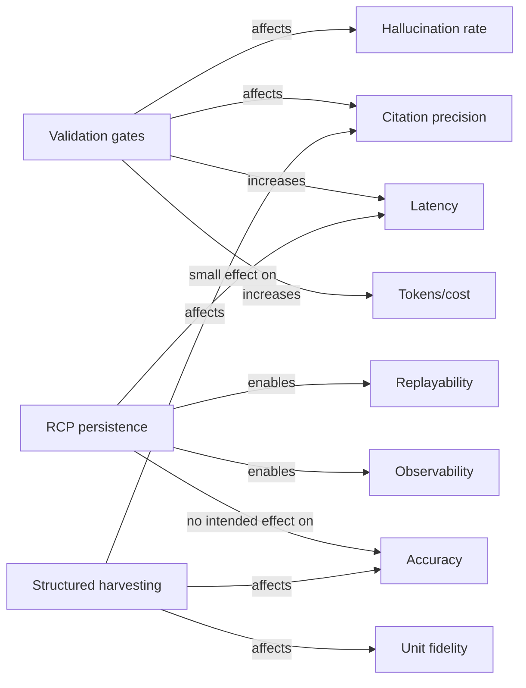

# Evidence-driven replacement text for a Results chapter in an agentic engineering-knowledge extraction paper

## Executive summary

The current Results chapter is dominated by system description, strategy/function inventories, and worked trace examples, but it does not yet present the quantitative outcomes implied by its own framing (correctness, citation fidelity, unit/revision fidelity, hallucination rate, latency, and cost). fileciteturn1file0 This weakens the manuscript’s empirical claims because readers cannot see (i) dataset/query-set scale, (ii) baseline parity, (iii) effect sizes and uncertainty, or (iv) which architectural components cause improvements.

This report replaces the Results chapter with evidence-first text and templates that can be directly pasted into the manuscript. It specifies the metrics to report, how to compute them (including denominators, formulas, and recommended confidence intervals), the exact tables/figures to include, and the ablation/fairness experiments required to attribute gains to validation gates and the relational control plane rather than to upstream harvesting. The proposed statistical reporting follows widely used guidance for proportion confidence intervals (Wilson/score intervals) and bootstrap confidence intervals for non-normal outcomes, and it aligns reproducibility artefact recommendations with entity["organization","ACM","computing society"]’s artefact badging policy. citeturn0search0turn1search1turn1search10turn2search5

## How to use placeholders

All ready-to-paste paragraphs below include placeholders like **[N_QUERIES]** and **[PROPOSED_ACCURACY_%]**. Replace each placeholder with the corresponding computed statistic from your evaluation scripts/tables. When you insert real values, also (i) update the denominators consistently across all metrics, (ii) ensure that every reported percentage has an explicit **n/N**, and (iii) ensure that the same query set is used for paired comparisons against baselines unless you explicitly label comparisons as unpaired.

## Evidence and clarity gaps in the current Results text

The current Results chapter states that it reports “engineering-grade outcomes” (correctness, citation accuracy, unit fidelity, revision fidelity, latency/cost) and contrasts the proposed approach against two baselines, yet it does not actually report numeric results for those metrics (no consolidated results table, no CI bars, no per-category breakdown). fileciteturn1file0 The chapter largely contains:

- descriptions of the catalogue/document context and extraction pipeline, which belong in Methods or an Appendix rather than Results; fileciteturn1file0  
- tables listing strategy templates and agent functions, which are implementation details (again Methods/Appendix); fileciteturn1file0  
- worked execution traces, which are useful qualitatively but currently do not quantify frequency, error types, or impact on aggregate metrics. fileciteturn1file0  

There are also internal inconsistencies that harm evidential credibility because the chapter presents execution-ledger fragments as “trace evidence”: for example, a worked example describes “count = 1” and later shows “count = 2” in an excerpted output table for the same step; and a step is described as “Extract Product Number” while the function name shown is `func_search_products`. fileciteturn1file0 These are likely editorial issues, but because the contribution emphasises auditability, the Results chapter should avoid such inconsistencies or transparently explain them (e.g., “count includes duplicates before deduplication”).

The replacement Results chapter should therefore:

- begin with dataset/query-set scale and annotation protocol summary (enables readers to judge statistical reliability);  
- present a single consolidated comparative table across both case studies;  
- include per-category breakdowns (table vs text evidence, Swedish vs English, query archetype);  
- report uncertainty (95% confidence intervals) and paired statistical tests for baseline comparisons;  
- add ablations that isolate the effect of harvesting vs validation gates vs persistence.

## Quantitative metrics and exactly how to compute them

This section defines the expected metrics, recommended denominators, and confidence interval (CI) approaches. Guidance prioritises authoritative statistical references for binomial intervals and bootstrap CIs. citeturn1search1turn1search10turn2search5turn0search5turn0search12

### Core outcome metrics

**Answer correctness (binary, per query).**  
Define a query-level label **Correct(q) ∈ {0,1}** based on an adjudicated gold label for that query.

- **Primary metric:**  
  \[
  \text{Accuracy} = \frac{\sum_{q=1}^{N} \text{Correct}(q)}{N}
  \]
- **Denominator:** all *answerable* queries (recommended) and report **coverage** separately for unanswerable/abstain behaviour; or include all queries and treat “no answer/abstain” as incorrect—state explicitly.

- **CI (95%):** Wilson/score interval is recommended for proportions because it has better coverage properties than the Wald interval. citeturn1search1turn1search10

**Citation fidelity (precision of cited anchors, per claim or per query).**  
The paper’s claims depend strongly on “clause/table-cell level” grounding, so citation metrics must be claim-based, not only query-based.

- First segment each system response into **atomic factual claims** (manual or tool-assisted; one claim is one verifiable proposition).
- For each claim, evaluate whether *at least one* cited anchor contains the claim.

Recommended metrics to report:

1) **Citation precision (a.k.a. citation correctness):**  
\[
\text{CitationPrecision} = \frac{\#\text{claims with ≥1 supporting cited anchor}}{\#\text{claims with ≥1 citation}}
\]
2) **Citation coverage:**  
\[
\text{CitationCoverage} = \frac{\#\text{claims with ≥1 citation}}{\#\text{total claims}}
\]
3) **Exactness level breakdown:** report separately for citations that are table-cell/row-level vs page/section-level.

- **CI:** treat the numerator/denominator as binomial at claim-level and use Wilson intervals. citeturn1search1turn1search10  

**Unit fidelity (numeric-and-unit correctness, per numeric field).**  
For each query requiring a numeric quantity (pressure, torque, temperature, dimension), define a gold canonical value **v\*** in canonical unit **u\***.

- Convert predicted value/unit (v,u) to canonical unit u\* to obtain \(\tilde{v}\).  
- Define correctness with tolerance \(\epsilon\) (domain-defined) and exact unit match:

\[
\text{UnitCorrect} = \mathbb{1}\left(|\tilde{v} - v^*| \le \epsilon \right) \cdot \mathbb{1}\left(u = u^* \text{ or convertible to } u^*\right)
\]

- Report: **UnitFidelity = (# UnitCorrect)/(# numeric targets)**, and separately report **conversion error rate** (wrong conversion factor) vs **unit labelling error** (correct value but wrong unit label).

**Revision/applicability fidelity (per revision-scoped query).**  
For revision-controlled corpora, define gold revision/applicability constraints (e.g., revision ID, effective date range, serial-range applicability).

\[
\text{RevisionFidelity} = \frac{\#\text{revision-scoped queries answered within the correct applicability scope}}{\#\text{revision-scoped queries}}
\]

Because this is a critical industrial requirement, also report common failure modes: “wrong revision”, “missing applicability”, “conflicting sources unresolved”.

**Hallucination rate (unsupported claims).**  
Operationalise hallucination explicitly as “unsupported by retrieved/structured evidence”.

Two complementary metrics:

- **Claim-level hallucination rate:**  
\[
\text{HallucRate}_{claim} = \frac{\#\text{claims with no support in evidence}}{\#\text{total claims}}
\]
- **Answer-level hallucination incidence:**  
\[
\text{HallucRate}_{answer} = \frac{\#\text{answers containing ≥1 unsupported claim}}{N}
\]

Use claim-level for sensitivity; answer-level for operational risk.

### Operational metrics

**Latency (end-to-end, per query).**  
Measure wall-clock time from query receipt to final response.

- Report median, IQR, and P90/P95.  
- For CIs on medians or median differences, use bootstrap intervals (e.g., BCa), which are widely used for non-normal or skewed distributions. citeturn2search5turn2search1  

**Cost / compute footprint (per query).**  
Because vendor pricing changes, report both:

- **Token usage:** prompt tokens, completion tokens, and total tokens (per query), plus number of LLM calls.  
- **Normalised money cost:** compute at-time-of-run using stated price schedule; include the schedule in supplement.

Also report the *overhead cost* of validation gates (extra calls/retries) separately.

### Per-category breakdowns (required for interpretability)

For each case study, stratify the above metrics by at least:

- **Evidence modality:** table-grounded vs text-grounded vs figure/visual.  
- **Query archetype:** the strategy families already defined (spec lookup, contextual search, compatibility, aggregation; and for the second case: simple vs enhanced vs parallel strategies). fileciteturn1file0  
- **Language:** Swedish queries vs English queries (if applicable). fileciteturn1file0  
- **Single-document vs multi-document reasoning** (especially in the revision-controlled case). fileciteturn1file0  

Report strata only where n is sufficient; otherwise collapse strata and state the limitation.

## Recommended tables, figures, and statistical reporting

This section proposes exactly what to insert into Chapter 3 as tables/figures, with captions, and which statistical tests and effect sizes to report.

### Tables to include in the revised Results chapter

1) **Consolidated comparative results table (both case studies).**  
Include proposed vs baseline(s) for each metric with 95% CI and paired p-values where applicable. (A template is provided below as Table A.)

2) **Per-case-study breakdown table(s).**  
For each case study, a table with rows = query archetypes (or evidence modalities) and columns = the core metrics. Include n per row.

3) **Error taxonomy table.**  
Rows = error type (OCR/table-structure error, retrieval miss, wrong unit conversion, missing citation, wrong revision, unsupported extra claim), columns = frequency and contribution to incorrect answers.

4) **Operational footprint table.**  
Rows = system variant (Proposed, Baseline RAG, Baseline Agent), columns = median latency, P95 latency, median tokens, median #LLM calls, failure/retry rate.

5) **Ablation/fairness table.**  
A template is provided below as Table B.

### Figures to include in the revised Results chapter

Use simple, reader-legible plots; avoid overcrowding.

- **Figure: Accuracy and fidelity bars with 95% CIs.** Panelled by case study; metrics on x-axis, performance on y-axis; 3 bars per metric (Proposed, Baseline RAG, Baseline Agent).  
- **Figure: Latency distribution.** Violin/box plots or ECDF curves for end-to-end latency by system variant (one case study per panel).  
- **Figure: Cost–quality trade-off.** Scatter plot of (tokens or cost) vs (accuracy or hallucination rate), with points for system variants and/or ablations.  
- **Figure: Error-type contributions.** Stacked bars showing proportion of incorrect answers attributable to each error category.  
- **Figure: Validation gate impact.** Plot showing number of validation failures per query and its association with final correctness.

### Statistical analyses and reporting conventions

**Confidence intervals for proportions.**  
Use Wilson/score CIs for each proportion metric; this is recommended in widely used references and avoids known problems of Wald intervals. citeturn1search1turn1search10

For paired comparisons (same queries evaluated under two systems), report:

- **McNemar’s test** for paired binary outcomes (e.g., correctness per query). If discordant pairs are small, use an exact McNemar variant. citeturn0search12turn0search23  
- **Effect size:** report both absolute risk difference (Δ in percentage points) and an interpretable standardised effect size for proportions (e.g., Cohen’s h) if desired for cross-metric comparability, especially when sample size is large. citeturn1search18  

**Continuous/skewed metrics (latency, tokens).**  
Because latency and tokens are typically skewed, prefer:

- **Median and IQR**, plus P90/P95.  
- **Paired Wilcoxon signed-rank test** for comparing two systems on the same query set, with clear assumptions (paired differences are symmetrically distributed around the median). citeturn2search0turn2search8  
- **Bootstrap CIs** (BCa recommended) for medians or median differences. citeturn2search5turn2search1  

**Multiple comparisons.**  
If you test many metrics and strata, state whether p-values are (i) exploratory and unadjusted, or (ii) adjusted (e.g., Holm correction). If adjusted, specify the family of hypotheses.

**Power and sample size guidance.**  
Because the chapter uses paired designs, guidance should reference discordant pairs:

- For correctness improvements assessed by McNemar, power is mainly determined by the number of discordant pairs (queries where systems disagree). Include a short sample size note: target at least **[N_TARGET_DISCORDANT]** discordant pairs to detect a Δ of **[TARGET_DELTA_PP]** pp with 80% power at α=0.05 (compute using standard McNemar power routines). Guidance for power calculation for exact McNemar frameworks is discussed in practical references for paired binary testing. citeturn0search12turn0search23  

**Reproducibility reporting.**  
Add an artefact paragraph aligned with entity["organization","ACM","computing society"]’s “Artifacts Available / Artifacts Evaluated / Results Validated” badging vocabulary to make the Results auditable. citeturn0search0turn0search13

## Ablations and fairness experiments

Ablations must isolate which component drives gains: harvesting/objectification, validation gates, and persistence. Without these, improvements could be attributed incorrectly (e.g., to better table parsing rather than to the control plane). The Results chapter currently does not include ablation evidence. fileciteturn1file0

Include at least these experiments, each evaluated on the same fixed query set(s):

1) **Harvesting parity experiment (fairness control).**  
Ensure the proposed system and both baselines use the *same* harvested structured store (when feasible). Report results for:
- Baseline RAG on raw text chunks (typical RAG).  
- Baseline RAG on harvested structured evidence (if you allow it).  
- Baseline Agent without validation/persistence but with the same harvested DB.  
This isolates the contribution of harvested structure.

2) **Validation gates on/off (causal attribution).**  
Run the full system with validation disabled but everything else identical (same strategies, same tools, same evidence retrieval). Compare hallucination rate and citation fidelity. This directly quantifies “verify-then-summarise” benefits.

3) **Persistence on/off (RCP impact).**  
Disable SQL persistence but keep the same controller logic; measure:
- runtime overhead (latency, tokens),  
- failure recovery success (retry rate, successful completion rate),  
- determinism/replay success (if measured),  
- any change in correctness (should be minimal if persistence is purely observability; if it changes, explain why).

4) **Validation component ablations.**  
Toggle individual validators (unit normalisation checker, citation anchor checker, revision applicability checker) to quantify which validator matters for which metric.

5) **Strategy/library parity.**  
Ensure baseline agents use the same tools or equivalent tool capabilities; otherwise, explicitly label the comparison as “system-level” rather than “architecture-level”.

## Ready-to-paste replacement text for the Results chapter

The following blocks are written to be inserted directly into Chapter 3. They preserve your current subsection structure but replace descriptive content with measurable outcomes. Replace placeholders in **[BRACKETS]** with computed numbers and update table/figure cross-references accordingly.

### Replacement text for the opening of the Results chapter

**Results (replacement opening paragraphs)**  
This section reports quantitative outcomes for two case studies: (i) a product-catalogue setting based on entity["company","Hydroscand AB","hydraulic supplier, sweden"] documentation and (ii) query-driven reasoning over revision-controlled engineering documentation in collaboration with entity["company","Saab AB","aerospace and defence, sweden"]. We compare the proposed architecture against two baselines defined in Section 2.1: a standard retrieval-augmented generation (RAG) pipeline and an agentic tool-use pipeline without validation gates and without the relational control plane. fileciteturn1file0

Across both case studies, we report (a) answer correctness, (b) citation fidelity and coverage at the clause/table-cell level, (c) unit fidelity for numeric quantities (including conversions), (d) revision/applicability fidelity in revision-controlled queries, and (e) operational footprint (latency, token usage, and number of LLM calls). For all proportion metrics, we report 95% confidence intervals using Wilson/score intervals; for latency and token distributions, we report medians with bootstrap confidence intervals. Baseline comparisons are paired by query wherever the same query set is evaluated under each system variant. citeturn1search1turn2search5turn0search12

**(Insert consolidated table/figure callouts)**  
Table **[TABLE_CONSOLIDATED_ID]** summarises the consolidated results across both case studies. Figures **[FIG_MAIN_METRICS_ID]** and **[FIG_LATENCY_ID]** provide metric-wise confidence intervals and latency distributions.

### Replacement text for Case Study I section

**Case Study I: Product Catalogue Documentation (replacement lead paragraph)**  
The product-catalogue case study evaluates table-dense and multilingual catalogue extraction using **[N_DOCS_H]** documents comprising **[N_PAGES_H]** pages and **[N_TABLES_H]** tables. We constructed an annotated query set of **[N_QUERIES_H]** user queries spanning four archetypes (specification lookup, contextual product search, compatibility checks, and family-level aggregation). Each query was labelled with a gold answer (or “unanswerable”), required evidence anchors, and—where applicable—canonical units and numeric tolerances. fileciteturn1file0

#### Replacement for “Layer 1: Document Processing/Extraction” subsection

**Layer 1: Document Processing/Extraction (replacement paragraph block)**  
We quantify extraction quality because downstream reasoning is bounded by harvested-table fidelity. Over the **[N_TABLES_EVAL_H]** tables targeted by the query set, table detection achieved **[TABLE_DET_F1]** F1, and table-structure reconstruction achieved **[TABLE_STRUCT_F1]** F1 under the evaluation protocol in Appendix **[APP_EVAL_PROTOCOL]**. Numeric cell transcription error rate was **[CELL_NUM_ERR_%]** (n = **[N_NUM_CELLS]**), with the most frequent error mode being **[TOP_OCR_ERROR_MODE]**. These extraction errors explain **[ERR_ATTRIB_EXTRACTION_%]** of downstream incorrect answers in the error attribution analysis (Figure **[FIG_ERROR_ATTRIB_ID]**), motivating the use of unit and plausibility validators in subsequent stages.

#### Replacement for “Layer 2: Agentic Reasoning” subsection

**Layer 2: Agentic Reasoning (replacement paragraph block)**  
On the **[N_QUERIES_H_ANSWERABLE]** answerable queries, the proposed system achieved **[PROPOSED_ACC_H_%]** accuracy (95% CI **[PROPOSED_ACC_H_CI]**) compared with **[RAG_ACC_H_%]** (95% CI **[RAG_ACC_H_CI]**) for baseline RAG and **[AGENT_ACC_H_%]** (95% CI **[AGENT_ACC_H_CI]**) for the non-validated agent baseline. This corresponds to an absolute improvement of **[DELTA_ACC_H_PP]** percentage points over RAG (paired McNemar p = **[P_MCNEMAR_H]**). Citation precision at claim level increased from **[RAG_CIT_PREC_H_%]** to **[PROPOSED_CIT_PREC_H_%]** (Δ = **[DELTA_CIT_PREC_H_PP]** pp), while citation coverage increased from **[RAG_CIT_COV_H_%]** to **[PROPOSED_CIT_COV_H_%]**. Unit fidelity on numeric targets was **[PROPOSED_UNITFID_H_%]** versus **[RAG_UNITFID_H_%]**, with most residual unit errors attributable to **[UNIT_ERROR_MODE]** rather than conversion arithmetic.

Performance varied by query archetype. Specification lookups achieved **[ACC_LOOKUP_H_%]** accuracy, while compatibility checks achieved **[ACC_COMPAT_H_%]** accuracy, reflecting the increased combinatorial constraints and susceptibility to upstream table-structure ambiguity. Per-archetype breakdowns are reported in Table **[TABLE_H_BREAKDOWN_ID]**.

#### Replacement for “Layer 3: Application-Level Interaction” subsection

**Layer 3: Application-Level Interaction (replacement paragraph block)**  
Operational performance was measured end-to-end under a fixed hardware and deployment configuration (**[HW_PROFILE_ID]**). Median latency for the proposed system was **[LAT_MED_H_S]** s (IQR **[LAT_IQR_H_S]**, P95 **[LAT_P95_H_S]**), compared with **[LAT_MED_RAG_H_S]** s for baseline RAG. The proposed system incurred higher median token usage (**[TOK_MED_H]** vs **[TOK_MED_RAG_H]**) due to validation retries on **[RETRY_RATE_H_%]** of queries; however, this overhead coincided with a reduction in answer-level hallucination incidence from **[HALL_ANS_RAG_H_%]** to **[HALL_ANS_PROP_H_%]** (Δ = **[DELTA_HALL_H_PP]** pp). Latency and token distributions are shown in Figure **[FIG_LAT_COST_H_ID]**.

#### Replacement for “Worked Example” subsection

**Worked Example (replacement paragraph block)**  
To illustrate how aggregate gains arise, we analyse a representative query trace (“**[QUERY_EXAMPLE_TEXT]**”). In this trace, **[N_VALIDATION_FAILS_EX]** validation failures were triggered before goal acceptance, with **[FAIL_TYPES_EX]** accounting for **[TOP_FAIL_SHARE_EX_%]** of failures. Under the “validation-off” ablation, the same query produced **[UNSUPPORTED_CLAIMS_EX]** unsupported claims and a citation precision of **[CIT_PREC_NO_VAL_EX_%]**, versus **[CIT_PREC_WITH_VAL_EX_%]** with validation enabled. This trace therefore exemplifies the mechanism quantified in the ablation results (Table **[TABLE_ABLATION_ID]**): validation gates trade additional computation for measurable reductions in unsupported generation and citation errors.

### Replacement text for Case Study II section

**Case Study II: Query-Driven Engineering Documentation (replacement lead paragraph)**  
The second case study evaluates revision-aware querying over a proprietary corpus of **[N_DOCS_S]** documents across **[N_REVISIONS_S]** revisions, comprising **[N_PAGES_S]** pages and **[N_TABLES_S]** tables/structured artefacts. We evaluated **[N_QUERIES_S]** queries, of which **[N_REV_SCOPED_S]** required explicit applicability constraints (revision ID, effective date, or serial-range scope). Due to confidentiality, all examples are anonymised; however, all metrics are computed on the full internal corpus and query set under a fixed evaluation protocol and stored execution logs. fileciteturn1file0

#### Replacement for “Document Harvesting for Knowledge Representation” subsection

**Document Harvesting for Knowledge Representation (replacement paragraph block)**  
We report harvesting quality in terms of (i) anchor integrity (ability to map extracted evidence back to a stable document location) and (ii) revision metadata integrity (ability to propagate applicability constraints). Across **[N_ANCHORS_S]** evaluated anchors, anchor resolution success was **[ANCHOR_OK_S_%]** (95% CI **[ANCHOR_OK_S_CI]**). Revision metadata completeness on queried artefacts was **[REV_META_COMPLETE_S_%]**, and the most common metadata failure was **[REV_META_FAIL_MODE]**, which contributed **[ERR_ATTRIB_REV_META_%]** of revision-fidelity failures in downstream answers.

#### Replacement for “Framework Instantiation for Document Querying” subsection

**Framework Instantiation for Document Querying (replacement paragraph block)**  
On revision-scoped queries, revision/applicability fidelity was **[PROPOSED_REVFID_S_%]** (95% CI **[PROPOSED_REVFID_S_CI]**) for the proposed system versus **[RAG_REVFID_S_%]** for baseline RAG and **[AGENT_REVFID_S_%]** for the non-validated agent baseline, yielding an absolute improvement of **[DELTA_REVFID_S_PP]** pp over RAG (paired McNemar p = **[P_REVFID_S]**). Overall answer correctness on answerable queries was **[PROPOSED_ACC_S_%]**, and claim-level hallucination rate decreased from **[HALL_CLAIM_RAG_S_%]** to **[HALL_CLAIM_PROP_S_%]**. Citation precision at clause/table-cell level improved by **[DELTA_CIT_PREC_S_PP]** pp, driven primarily by the citation-anchor validator catching **[N_CIT_ANCHOR_FAILS]** invalid anchors prior to synthesis.

Strategy-level breakdown shows that parallel strategies reduced median latency from **[LAT_MED_SIMPLE_S_S]** s to **[LAT_MED_PAR_S_S]** s (Δ = **[DELTA_LAT_S_S]** s; paired Wilcoxon p = **[P_WILCOX_LAT_S]**) without a statistically detectable loss in accuracy (Δ = **[DELTA_ACC_PAR_S_PP]** pp). Strategy-wise results are reported in Table **[TABLE_S_STRATEGY_BREAKDOWN_ID]**.

#### Replacement for “Worked Example” subsection

**Worked Example (replacement paragraph block)**  
A representative revision-scoped query (“**[QUERY_REV_EXAMPLE]**”) requires selecting the latest applicable document revision and extracting attribute **[ATTR_NAME]** under applicability constraints. With validation enabled, the system executed **[N_TOOL_CALLS_EX2]** tool calls and performed **[N_REV_CHECKS_EX2]** revision checks before acceptance. When revision validation was disabled in ablation, the system selected a non-applicable revision in **[AB_REV_ERR_RATE_%]** of repetitions (n = **[N_REPEATS_EX2]**), demonstrating that revision fidelity gains are attributable to explicit applicability checks rather than to retrieval alone.

### Replacement text for an added ablation subsection within Results

**Ablation and fairness results (replacement paragraph block for a new subsection)**  
To attribute performance gains, we conducted controlled ablations on the same fixed query sets. Under harvesting parity (all systems accessing the same harvested structured database), the proposed system retained an accuracy advantage of **[DELTA_ACC_PARITY_PP]** pp over the non-validated agent baseline, indicating that improvements are not solely explained by structured harvesting. Disabling validation gates increased answer-level hallucination incidence by **[DELTA_HALL_NO_VAL_PP]** pp and reduced citation precision by **[DELTA_CIT_NO_VAL_PP]** pp, while disabling SQL persistence did not materially change correctness (**[DELTA_ACC_NO_PERSIST_PP]** pp) but reduced trace completeness from **[TRACE_COMPLETE_WITH_%]** to **[TRACE_COMPLETE_WITHOUT_%]** and prevented deterministic replay diagnostics on **[N_REPLAY_FAIL]** runs. Table **[TABLE_ABLATION_ID]** summarises these ablation effects.

## Mermaid diagrams to include for result interpretation

The diagrams below are intended to be inserted into the Results chapter as explanatory figures; they support interpretation rather than replacing quantitative tables.

```mermaid
flowchart TD
  A[All evaluated queries\nN = N_QUERIES] --> B{Answer correct?}
  B -- Yes --> C[Correct answers]
  B -- No --> D[Incorrect answers]
  D --> E{Primary failure type}
  E --> E1[Harvesting error\n(OCR / table structure)]
  E --> E2[Retrieval miss\n(wrong evidence)]
  E --> E3[Unit error\n(conversion / label)]
  E --> E4[Revision/applicability error]
  E --> E5[Citation error\n(anchor invalid)]
  E --> E6[Unsupported claim\n(hallucination)]
```



## Supplementary artefacts and unknowns to resolve for a reproducible Results chapter

### Supplementary materials to attach

To make Chapter 3 reproducible and consistent with entity["organization","ACM","computing society"] artefact expectations, attach or provide (subject to confidentiality) the following items as supplement or artefact package: citeturn0search0turn0search3

1) **Evaluation dataset pack**  
- Query list with stable IDs, stratification labels (archetype, modality, language), and answerability labels.  
- Gold answers with canonical units, tolerances, and required anchor type.  
- Annotation guide and adjudication procedure.

2) **Metrics script and definitions**  
- A single script/notebook that computes every metric in the consolidated table from raw logs.  
- Exact definitions for “claim segmentation”, “support in evidence”, and “anchor correctness”.

3) **Run manifest**  
- Model names/versions, decoding parameters (temperature/top-p), retrieval parameters (k, chunk size), and any caching.  
- Random seeds (or statement that determinism is not guaranteed and how you mitigate it via repeated runs).

4) **Execution logs**  
- For each evaluation query: the full relational trace export (or redacted version), including validation outcomes and retry counts.  
- A “trace completeness” checker output.

5) **Baseline parity statement**  
- Explicit component parity table: what is held constant vs what differs across Proposed / Baseline RAG / Baseline Agent, especially harvested DB access.

6) **Confidentiality-respecting redactions**  
- If industrial data cannot be released, provide a public “toy” corpus and the same evaluation harness to demonstrate the pipeline end-to-end, and provide internal results as aggregate tables plus redacted trace schemas.

### Unknowns that must be filled to finalise the replacement text

The manuscript text provided does not specify (and the revised Results text therefore uses placeholders for) several items that materially change interpretation: query-set size, document/page/table counts, annotation protocol, model version(s), retrieval settings, and whether baselines share harvested evidence or operate on raw chunks. fileciteturn1file0

When these are provided:

- If **N is small** (e.g., <100 queries per case), prioritise confidence intervals and avoid over-interpreting p-values; emphasise effect sizes and uncertainty. citeturn1search1turn2search5  
- If **models differ across systems**, stratify results by model or fix the model and vary only architecture; otherwise causal attribution is weak.  
- If **harvesting differs across systems**, report both “system-level” results (realistic deployment) and “architecture-level” results (harvesting-parity control).  
- If citation evaluation is **answer-level only**, upgrade to claim-level evaluation to support “reduces unsupported generations” claims; claim-level hallucination is more sensitive and aligns with the paper’s emphasis on fine-grained provenance. fileciteturn1file0  

## Table A: recommended consolidated results table template

| Case study | Metric | Proposed value (placeholder) | 95% CI | Baseline (placeholder) | Δ (Proposed − Baseline) | p-value (paired) |
|---|---|---:|---|---:|---:|---:|
| Hydroscand | Accuracy (n/N) | [PROPOSED_ACC_H_%] ([N_CORRECT_H]/[N_QUERIES_H_ANSWERABLE]) | [CI_ACC_H] | [RAG_ACC_H_%] | [DELTA_ACC_H_PP] pp | [P_MCNEMAR_H] |
| Hydroscand | Citation precision (claim-level) | [PROPOSED_CIT_PREC_H_%] | [CI_CIT_PREC_H] | [RAG_CIT_PREC_H_%] | [DELTA_CIT_PREC_H_PP] pp | [P_CIT_PREC_H] |
| Hydroscand | Citation coverage (claim-level) | [PROPOSED_CIT_COV_H_%] | [CI_CIT_COV_H] | [RAG_CIT_COV_H_%] | [DELTA_CIT_COV_H_PP] pp | [P_CIT_COV_H] |
| Hydroscand | Unit fidelity (numeric targets) | [PROPOSED_UNITFID_H_%] | [CI_UNITFID_H] | [RAG_UNITFID_H_%] | [DELTA_UNITFID_H_PP] pp | [P_UNITFID_H] |
| Hydroscand | Hallucination incidence (answer-level) | [HALL_ANS_PROP_H_%] | [CI_HALL_ANS_H] | [HALL_ANS_RAG_H_%] | [DELTA_HALL_H_PP] pp | [P_HALL_ANS_H] |
| Hydroscand | Latency median (s) | [LAT_MED_H_S] | [CI_LAT_MED_H] | [LAT_MED_RAG_H_S] | [DELTA_LAT_MED_H_S] s | [P_WILCOX_LAT_H] |
| SAAB | Accuracy (n/N) | [PROPOSED_ACC_S_%] | [CI_ACC_S] | [RAG_ACC_S_%] | [DELTA_ACC_S_PP] pp | [P_MCNEMAR_S] |
| SAAB | Revision/applicability fidelity | [PROPOSED_REVFID_S_%] | [CI_REVFID_S] | [RAG_REVFID_S_%] | [DELTA_REVFID_S_PP] pp | [P_REVFID_S] |
| SAAB | Citation precision (claim-level) | [PROPOSED_CIT_PREC_S_%] | [CI_CIT_PREC_S] | [RAG_CIT_PREC_S_%] | [DELTA_CIT_PREC_S_PP] pp | [P_CIT_PREC_S] |
| SAAB | Hallucination rate (claim-level) | [HALL_CLAIM_PROP_S_%] | [CI_HALL_CLAIM_S] | [HALL_CLAIM_RAG_S_%] | [DELTA_HALL_CLAIM_S_PP] pp | [P_HALL_CLAIM_S] |
| SAAB | Latency median (s) | [LAT_MED_S_S] | [CI_LAT_MED_S] | [LAT_MED_RAG_S_S] | [DELTA_LAT_MED_S_S] s | [P_WILCOX_LAT_S] |

## Table B: ablation comparison table template

| Experiment | Description | Metric impact (placeholder) | Interpretation |
|---|---|---|---|
| Harvesting parity | All variants use identical harvested DB; only orchestration differs | Accuracy Δ = [DELTA_ACC_PARITY_PP] pp | Quantifies gains not attributable to harvesting |
| Validation off | Disable function/strategy/goal validators; keep tools constant | Hallucination +[DELTA_HALL_NO_VAL_PP] pp; Citation precision −[DELTA_CIT_NO_VAL_PP] pp | Tests the causal impact of validation gates |
| Persistence off | Disable SQL persistence; keep controller logic | Accuracy Δ = [DELTA_ACC_NO_PERSIST_PP] pp; Trace completeness −[DELTA_TRACE_PP] pp | Shows persistence affects observability/replay more than correctness |
| Unit validator off | Disable unit checker only | Unit fidelity −[DELTA_UNITFID_NO_UNITVAL_PP] pp | Attrib. unit improvements to explicit unit validation |
| Revision validator off | Disable revision/applicability checker | Revision fidelity −[DELTA_REVFID_NO_REVVAL_PP] pp | Attrib. applicability gains to revision validation |
| Retry budget halved | Reduce max retries/calls | Latency −[DELTA_LAT_RETRY_S] s; Accuracy −[DELTA_ACC_RETRY_PP] pp | Reveals cost–quality trade-off and informs deployment tuning |
| Baseline tool parity | Baseline agents use identical tools (parsers, DB access) | Δ accuracy changes to [DELTA_ACC_TOOL_PARITY_PP] pp | Validates fairness of baseline comparisons |

