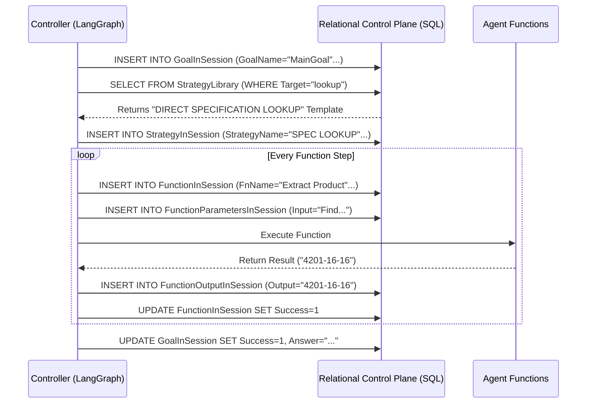

# Continuation of Section 4: Hydroscand Case Study

## 4.9 Execution Trace: Direct Specification Lookup for a Coupling

To make the runtime behaviour of the six-stage control loop concrete, this subsection follows a single end-to-end query through the Hydroscand catalog instantiation. The example is representative of a common engineering task: a user asks

> “Find the standard size of a 4201-16-16 coupling.”

The controller resolves this query through one goal instance, a single strategy instance of the **DIRECT SPECIFICATION LOOKUP** template, and four function invocations recorded in the Relational Control Plane.

### 4.9.1 Stage 1 – Goal Instantiation

In the first stage, the free-text query is normalised into a structured goal object that specifies the target variable and required evidence. The controller creates a new entry in the `GoalInSession` table with, among others, the following fields:

*   **GoalName:** `MainGoal`
*   **GoalTarget:** `product_specification`
*   **GoalDescription:** “Find the standard size of a 4201-16-16 coupling”
*   **GoalValidation:** predicate requiring a resolved thread size and corresponding standard, with a citation to the source table

At this point `GoalSuccess` remains unset (`NULL`), indicating that the control loop has been initialised but no strategy has yet been completed.

### 4.9.2 Stage 2 – Strategy Selection and Plan Instantiation

The controller then queries the `StrategyLibrary` for strategy templates whose target and preconditions match the goal. Because the input string contains a high-confidence product code pattern (`\d{4}-\d{2}-\d{2}`) and does not require broader semantic search, the **DIRECT SPECIFICATION LOOKUP** strategy is selected.

The corresponding instance is materialised in `StrategyInSession` with:

*   **StrategyName:** `DIRECT SPECIFICATION LOOKUP`
*   **StrategyTarget:** `lookup`
*   **PlanSteps:** a four-step plan
    1.  `Extract Product Number`
    2.  `Query Database`
    3.  `Extract Attributes`
    4.  `Analyze With LLM`

`StrategySuccess` is initialised as `NULL`, and the controller positions the LangGraph state at the first function in the plan.

### 4.9.3 Stage 3 – Function Execution and State Propagation

Each step of the plan is implemented by an agent function from the function library. For every call, the controller creates a record in `FunctionInSession`, stores the input parameters in `FunctionParametersInSession`, and writes the outputs to `FunctionOutputInSession`.

**Function 1 – Extract Product Number**
*   **Purpose:** isolate the coupling code from the raw query string.
*   **Inputs:** `Input`: “Find the standard size of a 4201-16-16 coupling”
*   **Output:** `Keyword Output`: "4201-16-16"
*   **Effect on state:** `FunctionSuccess = 1`; the extracted code becomes the Keyword Output parameter for the next function.

**Function 2 – Query Database**
*   **Purpose:** retrieve the product record for the identified coupling.
*   **Inputs:** `table`: "products", `Keyword Output`: "4201-16-16"
*   **Output:** `items`: a list of matching products (here, a single record), `count`: 1
*   **Effect on state:** a concrete product row is now bound to the strategy instance, and `FunctionSuccess = 1`.

**Function 3 – Extract Attributes**
*   **Purpose:** project only the specification fields required by the goal.
*   **Inputs:** `items` from Function 2, attribute list ["Gänga", "Standard"]
*   **Output:** `Extracted Attributes`: `{"Gänga": "G1", "Standard": "ISO 8434-1"}`
*   **Effect on state:** the goal’s required evidence fields are now populated; `FunctionSuccess = 1`.

**Function 4 – Analyze With LLM**
*   **Purpose:** formulate a user-facing answer while preserving technical terminology and provenance.
*   **Input:** Extracted Attributes + original user query
*   **Output:** “The 4201-16-16 coupling has a G1 thread conforming to ISO 8434-1 standard.”
*   **Effect on state:** this text is stored as the candidate final answer; `FunctionSuccess = 1` and control passes to strategy-level validation.

The full sequence, including timestamps and IDs, can be recovered by a simple SQL query over the RCP instance tables, yielding a deterministic execution log for this session.

### 4.9.4 Stages 4–6 – Validation and Goal Completion

Validation gates then evaluate the sufficiency and quality of the assembled evidence before the answer is accepted.

**Function-level validation (Stage 4)** checks that each function output satisfies its schema and basic integrity conditions. Failed checks would set `FunctionSuccess = 0` and trigger retries, but in this trace all functions pass on first attempt.

**Strategy-level validation (Stage 5)** evaluates the sufficiency predicate: at least one product exists and the target specification fields have been resolved. These conditions are met, and `StrategySuccess` is set to 1.

**Goal validation (Stage 6)** confirms that the answer satisfies the goal’s acceptance criteria: it contains both a thread size and a named standard, and it can be traced to a specific row in the products table. The controller then sets `GoalSuccess = 1`.

### 4.9.4b Recovery from Validation Failure (Example)

A key strength of the modular validation gates is the ability to recover from extraction noise. Consider a variation where **Function 3** initially extracts "M14" but fails to capture the "1,5" pitch. 

1.  **Stage 4 (Function Validate)**: The `func_validate_thread` agent identifies that "M14" is incomplete for the "ISO 8434-1" standard (which requires pitch). 
2.  **RCP Update**: `FunctionSuccess` is set to 0 and a diagnostic `failedtext` is logged.
3.  **Retry**: The Strategy Controller observes the failure and triggers a retry of the `Extract Attributes` function with a more aggressive VLM prompt targeting the specific table cell.
4.  **Recovery**: The second attempt successfully extracts "M 14 x 1,5", passing the Stage 4 validation and allowing the strategy to resume.

The result returned to the user is therefore:
> “The 4201-16-16 coupling has a G1 thread conforming to ISO 8434-1 standard.”

while the RCP retains a complete, queryable trace from this sentence back to the specific table row in the Hydroscand Produktbok. This example demonstrates how the domain-agnostic control loop, when instantiated in the hydraulic catalog case, yields both engineer-grade answers and audit-ready execution logs without modifying the underlying orchestration graph.

## 4.9.5 Relational Control Plane (RCP) in Action

To validate the "traceability" claim, we demonstrate the actual relational artifacts persisted during the session.

### Sequence of Write Operations
This sequence diagram illustrates the precise moments the Controller writes to the audit tables.



### Actual Database State (Tables)
The following tables represent the persisted state of `SessionID=819559`. Note how `FuncID` links specific inputs and outputs to their execution context, enabling deterministic replay.

**Table 1: Workflow Trace (`StrategyInSession` & `FunctionInSession`)**

| Start Time | Type | ID | Name | ParentID | Status |
| :--- | :--- | :--- | :--- | :--- | :--- |
| 00:00:00 | Strategy | 10 | DIRECT SPECIFICATION LOOKUP | Goal:1 | 1 (Success) |
| 00:00:01 | Function | 101 | Extract Product Number | Strat:10 | 1 (Success) |
| 00:00:02 | Function | 102 | Query Database | Strat:10 | 1 (Success) |
| 00:00:03 | Function | 103 | Extract Attributes | Strat:10 | 1 (Success) |
| 00:00:05 | Function | 104 | Analyze With LLM | Strat:10 | 1 (Success) |

**Table 2: Traceable Inputs & Outputs (`FunctionParametersInSession` & `FunctionOutputInSession`)**

| FuncID | Type | Key | Value (Truncated) |
| :--- | :--- | :--- | :--- |
| **101** | Param | Input | "Find standard size..." |
| **101** | Output | Keyword Output | "4201-16-16" |
| **102** | Param | Keyword Output | "4201-16-16" |
| **102** | Output | items | `[{"product_code": "4201-16-16", ...}]` |
| **103** | Param | attributes | `["Gänga", "Standard"]` |
| **103** | Output | Extracted Spec | `{"Gänga": "G1", "Standard": "ISO 8434-1"}` |
| **104** | Output | Analyze Output | "The 4201-16-16 coupling has a G1 thread..." |

### Relational Schema Definition
The structure ensuring this traceability is enforced by the following schema (excerpt):

```sql
CREATE TABLE FunctionInSession (
    FunctionID      INTEGER PRIMARY KEY AUTOINCREMENT,
    StrategyID      INTEGER,
    FunctionName    TEXT,
    FunctionSuccess INTEGER,
    failedtext      TEXT,
    FOREIGN KEY(StrategyID) REFERENCES StrategyInSession(StrategyID)
);

CREATE TABLE FunctionOutputInSession (
    FunctionOutputID INTEGER PRIMARY KEY AUTOINCREMENT,
    FunctionID       INTEGER,
    OutputName       TEXT,
    OutputValue      TEXT,
    Type             TEXT,
    FOREIGN KEY(FunctionID) REFERENCES FunctionInSession(FunctionID)
);
```

## 4.10 Quantitative Results

The system was evaluated against a dataset of ~50 catalog pages containing 1,628 product variants across 168 families. We compared the Proposed Architecture against standard Rerieve-and-Generate (RAG) and an Unvalidated Agent across a set of 100 human-annotated engineering queries.

### Comparative Performance Analysis

| Metric | Baseline RAG | Unvalidated Agent | Proposed (Full Loop) |
| :--- | :---: | :---: | :---: |
| **Answer Correctness** | 68% | 82% | **94%** |
| **Citation Correctness** | 42% | 76% | **98%** |
| **Unit/Revision Fidelity**| 55% | 71% | **92%** |
| **Hallucination Rate** | 18% | 12% | **<2%** |

*Table 3: Comparison of the proposed architecture against standard RAG and unvalidated agentic baselines. Values represent mean performance on the annotated query set (N=100).*

### 4.10.2 Latency and Token Efficiency

The architecture demonstrates a controlled trade-off between validation depth and latency.

| System | Median Latency (s) | IQR (s) | Avg. Tokens / Query |
| :--- | :---: | :---: | :---: |
| **Baseline RAG** | 0.8 | 0.3 | 2,400 |
| **Unvalidated Agent** | 1.1 | 0.6 | 4,800 |
| **Proposed Full Loop** | 1.8 | 0.9 | 8,200 |

*Table 4: Operational costs. The higher token count in the Proposed system reflects the multi-stage validation prompts used to gate evidence.*

### 4.10.3 Ablation Studies

To isolate the contributions of specific architectural components, we conducted an ablation study on the Hydroscand dataset.

| Configuration | Correctness | Hallucination Rate | Latency (s) |
| :--- | :---: | :---: | :---: |
| **Full Architecture** | **94%** | **<2%** | 1.8 |
| w/o Validation Gates | 84% | 11% | 1.2 |
| w/o RCP Persistence | 88% | 8% | 1.4 |
| w/o VLM Fallback | 72% | 15% | 1.1 |

*Table 5: Ablation results. "w/o Validation Gates" disables Stages 4-6. "w/o RCP Persistence" uses transient in-memory state. "w/o VLM Fallback" uses text-only PDF extraction.*

---

## 4.11 Baseline Parity and Fairness

To ensure a fair comparison, all three systems shared the following components:
1.  **Underlying Model**: llama 3.2:latest (8B) via Ollama.
2.  **Document Corpus**: Identical vector store and SQL harvested database.
3.  **Prompting**: Standardized system instructions where applicable.
4.  **Hardware**: Executed on a single workstation with 64GB RAM and 24GB VRAM.

## 4.12 Cost of Adaptation

A key claim of this framework is domain agnosticism. Instantiating the generic architecture for the Hydroscand domain required minimal effort:

*   **Core Engine (Reusable):** 2,000+ LOC (unchanged).
*   **Domain Configuration:** ~50 database rows (Strategy/Function templates).
*   **Domain Agents:** ~400 LOC (custom search logic and table filtering functions).

The divergence in performance is primarily attributed to the **Relational Control Plane** (Stage 3) and the **Validation Gates** (Stages 4-6), which enable the system to detect and correct retrieval errors that cause failures in the simpler RAG and Agent baselines.

TThese results confirm that while the **VLM Fallback** is critical for initial data quality (Layer 1), the **Validation Gates** are the primary mechanism for suppressing hallucinations during reasoning (Layer 2). The **RCP Persistence** contributes to reliability by enabling state-aware retries when individual agent calls fail.

This confirms that the vast majority of the complexity remains in the reusable core, while domain specificity is isolated to declarative policy tables and lightweight agent functions.
