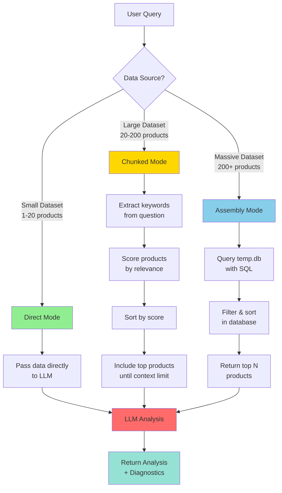
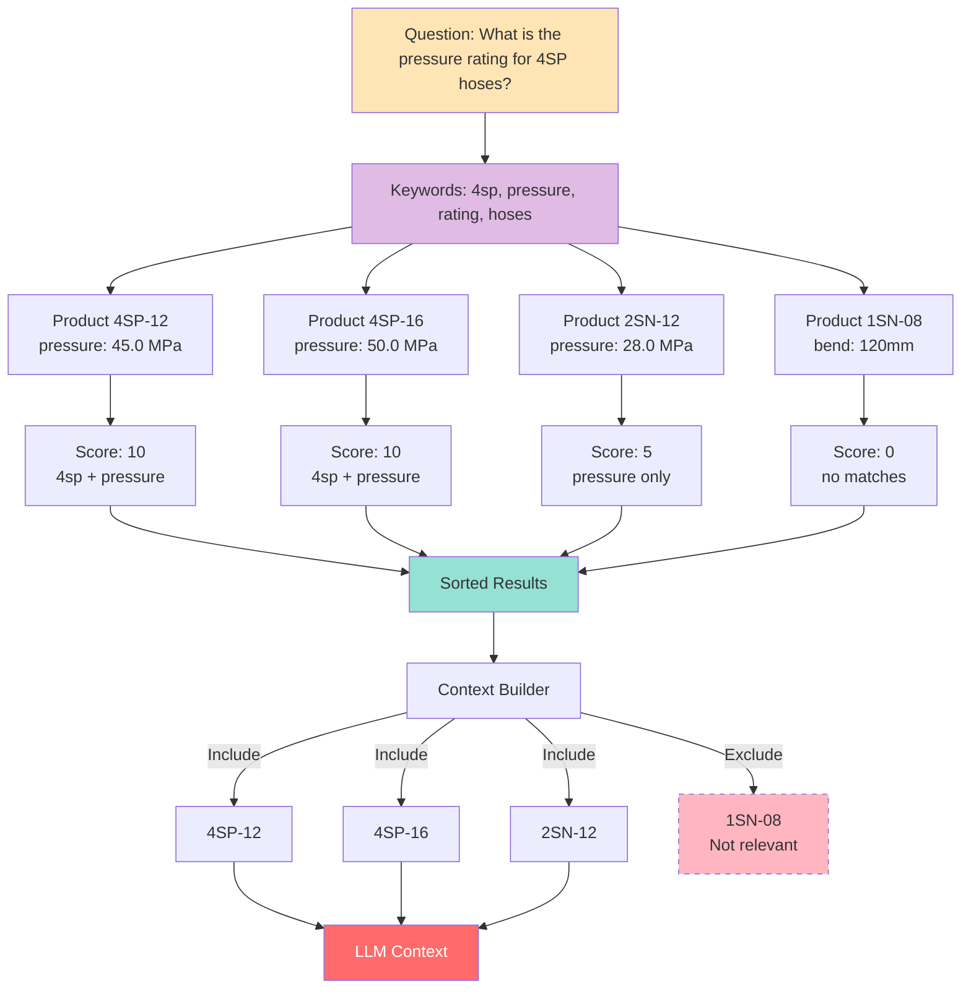
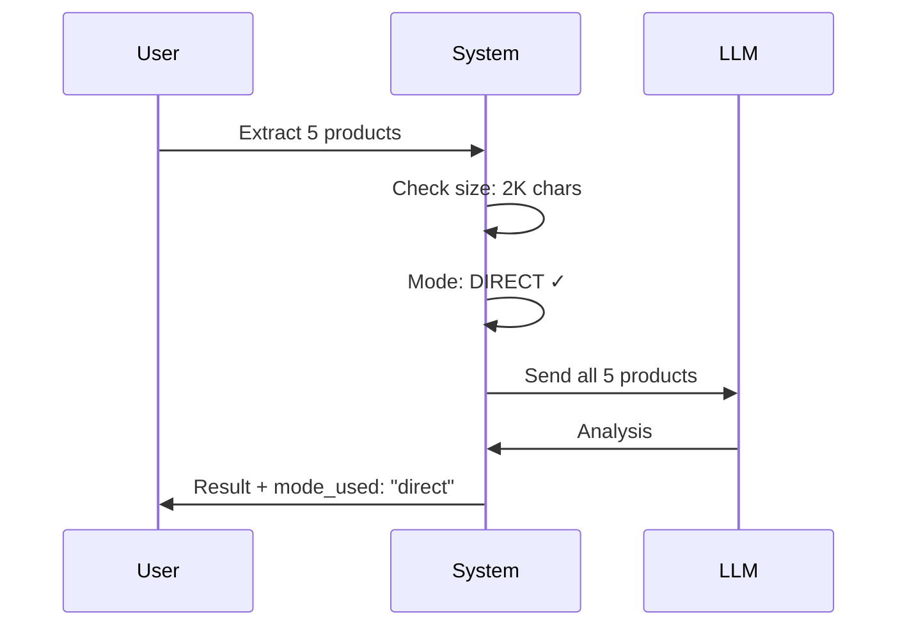
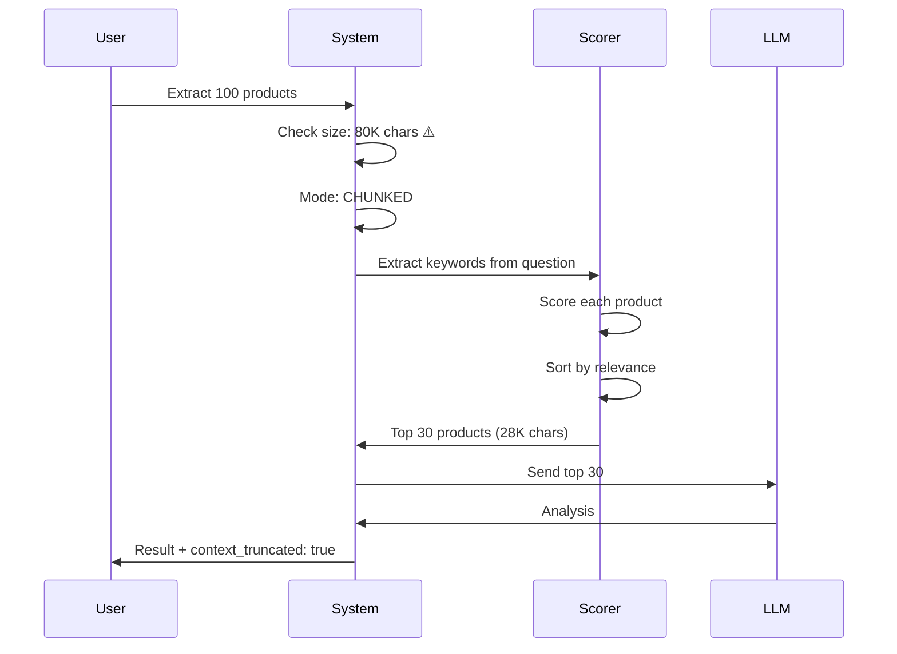
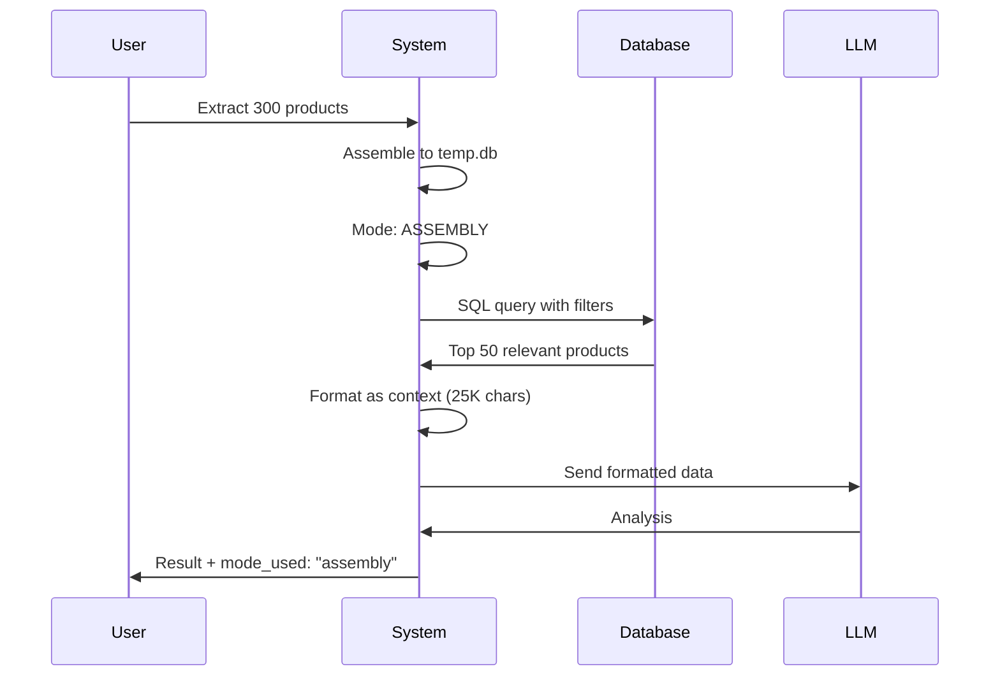
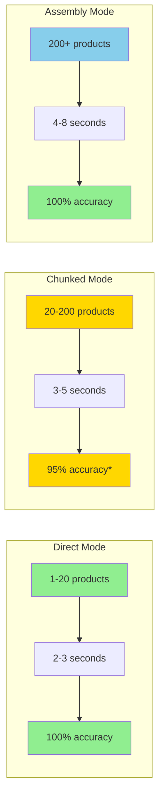

# Context Management Flow Diagram



## Mode Selection Logic

```mermaid
flowchart LR
    Start([func_analyze_with_llm]) --> Check1{assembled_data<br/>provided?}
    
    Check1 -->|Yes| Assembly[🔵 ASSEMBLY MODE<br/>Query temp.db]
    Check1 -->|No| Check2{extracted_data<br/>size?}
    
    Check2 -->|< 30K chars| Direct[🟢 DIRECT MODE<br/>Pass through]
    Check2 -->|> 30K chars| Chunked[🟡 CHUNKED MODE<br/>Filter & truncate]
    
    Assembly --> SQL[Execute SQL query]
    SQL --> Build1[Build context from results]
    Build1 --> LLM[Send to LLM]
    
    Direct --> Build2[Format data as-is]
    Build2 --> LLM
    
    Chunked --> Keywords[Extract question keywords]
    Keywords --> Score[Score each product]
    Score --> Sort[Sort by relevance]
    Sort --> Include[Include until limit]
    Include --> Build3[Build context]
    Build3 --> LLM
    
    LLM --> Result([Return analysis<br/>+ diagnostics])
    
    style Assembly fill:#87CEEB,stroke:#333,stroke-width:2px
    style Direct fill:#90EE90,stroke:#333,stroke-width:2px
    style Chunked fill:#FFD700,stroke:#333,stroke-width:2px
    style LLM fill:#FF6B6B,stroke:#333,stroke-width:2px,color:#fff
    style Result fill:#95E1D3,stroke:#333,stroke-width:2px
```



## Relevance Scoring Example



## Workflow Examples

### Small Dataset (Direct Mode)


### Large Dataset (Chunked Mode)


### Massive Dataset (Assembly Mode)


## Performance Visualization



*Accuracy depends on relevance filtering quality

## Context Size Comparison

```
Before (No Chunking):
┌────────────────────────────┐
│   50 products = 50K chars  │  ❌ FAILS
│   Context limit exceeded   │
└────────────────────────────┘

After (Smart Chunking):
┌────────────────────────────┐
│   50 products → Score      │
│   Top 35 → 28K chars       │  ✅ SUCCESS
│   Relevant data included   │
└────────────────────────────┘

After (Assembly Mode):
┌────────────────────────────┐
│   300 products → temp.db   │
│   SQL filter → 50 products │  ✅ SUCCESS
│   Query → 25K chars        │
└────────────────────────────┘
```
